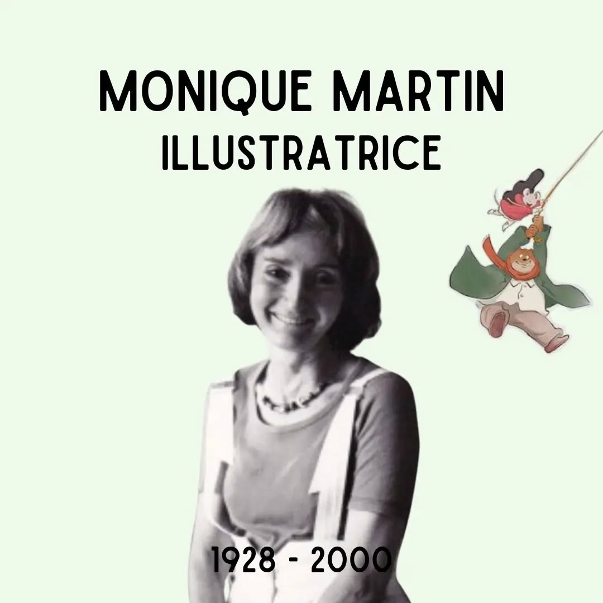

# C_skua_tSpA

**Date:** 2024-09-09 14:30:48

## Images

## Caption

Vandaag 96 jaar geleden is Monique Martin geboren in Brussel in een artistiek gezin. Ze is al vroeg in de weer met potloden en wanneer ze nog maar 15 jaar is worden haar werken al op postkaartjes gedrukt. Ze studeert aan de Académie des Beaux-Arts in Brussel, waar ze met prijzen gaat lopen voor haar eindwerken. Ze blinkt uit door de veelheid van methodes die ze beheerst (potlood, inkt, aquarel, etc.), maar toch is ze - als artiest - een beetje in de vergetelheid geraakt omdat ze het moeilijk vindt om een waarde te koppelen aan haar werken en hierdoor steeds minder exposeert. Als illustratrice van kinderboeken echter, neemt haar carrière een lift. In de jaren '80 neemt ze het pseudoniem Gabrielle Vincent aan; ze schaamt zich om dit in eigen naam te doen omdat ze denkt dat collega's hierover zouden oordelen. Ze wordt wereldberoemd dankzij de creatie van de personnages 'Ernest et Célestine' en de albumreeks over hun avonturen. 'Ernest & Celestine' is in 2012 nog verfilmd geweest en in de prijzen gevallen. Monique Martin illustreert (en schrijft) tot het einde van haar leven vele kinderboeken, en heeft de generaties illustratoren na haar enorm geïnspireerd. Ze overlijdt op 24 september 2000 in Brussel. 

Bron: @fondation_monique_martin
#ZijWasEens #MoniqueMartin

