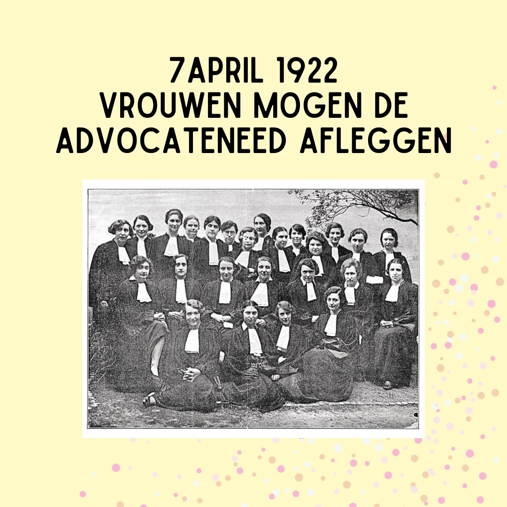
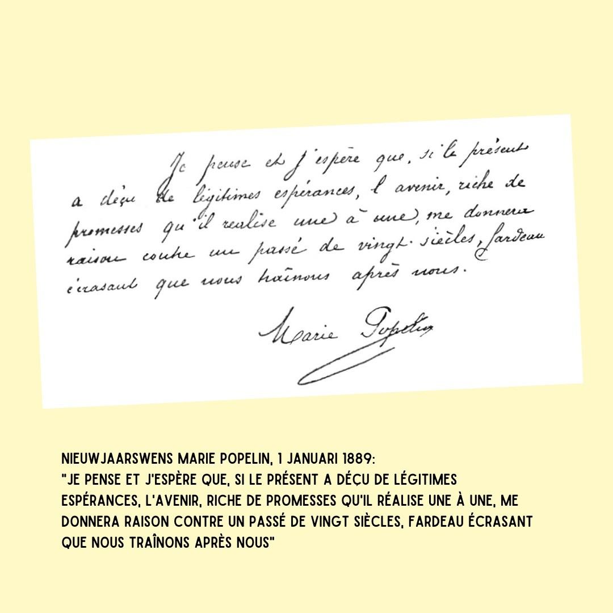

# CcCqAGxKWlQ

**Date:** 2022-04-07 09:30:00

## Images

## Caption

Exact 100 jaar geleden veranderde er iets in het juridisch landschap in België! Vanaf dan mogen vrouwen de advocateneed afleggen, en dus het beroep van advocaat uitoefenen. 

Voor 1922 waren er al vrouwen die rechten gestudeerd hadden. De bekendste onder hen is Marie Popelin, die in 1888 afstudeert aan de ULB. Ze is de eerste vrouwelijke rechtenstudent aan een Belgische universiteit. Rond de periode van haar afstuderen wordt in de kranten al gespeculeerd over 'la femme-avocat', de vrouwelijke advocaat in België. Een van de hevige voorvechters van deze zaak is Louis Frank, een studiegenoot van Popelin die een boekje uitbrengt waar hij pleit voor vrouwelijke advocaten, i.h.b. voor Popelin. Wanneer Popelin haar eed wil afleggen wordt dit haar geweigerd: vrouwen kunnen in België geen advocaat worden. Ze gaat tegen deze beslissing in beroep. "Mej. Popelin, zegt men, heeft het recht de vruchten te plukken van hare studiën; doch waarom heeft zij eene loopbaan gekozen welke zij, tegen alle wetten en regels in, wilde binnendringen?" schrijven de kranten. Ook in beroep krijgt Popelin ongelijk. Popelin overlijdt in 1913 en zal de eerste vrouwen aan onze balies niet meer meemaken. 

De zaak-Popelin heeft heel wat in gang gezet in België. Vrouwen ondervinden moeilijkheden om hun recht op hoger onderwijs en hun recht op de uitoefening van een beroep af te dwingen. In 1892 richten Popelin en Louis Frank, samen met Louise Popelin (zus van), Henri en Léonie La Fontaine, Isala Van Diest en Hector Denis de Belgische Liga voor de Rechten van de Vrouw op. Deze beweging is vooral bezig met sociaal en moraliserend werk, maar hun impact is niet te onderschatten; ze zijn de drijvende kracht achter verschillende juridische hervormingen in de strijd om gelijke rechten voor vrouwen. 

#ZijWasEens

