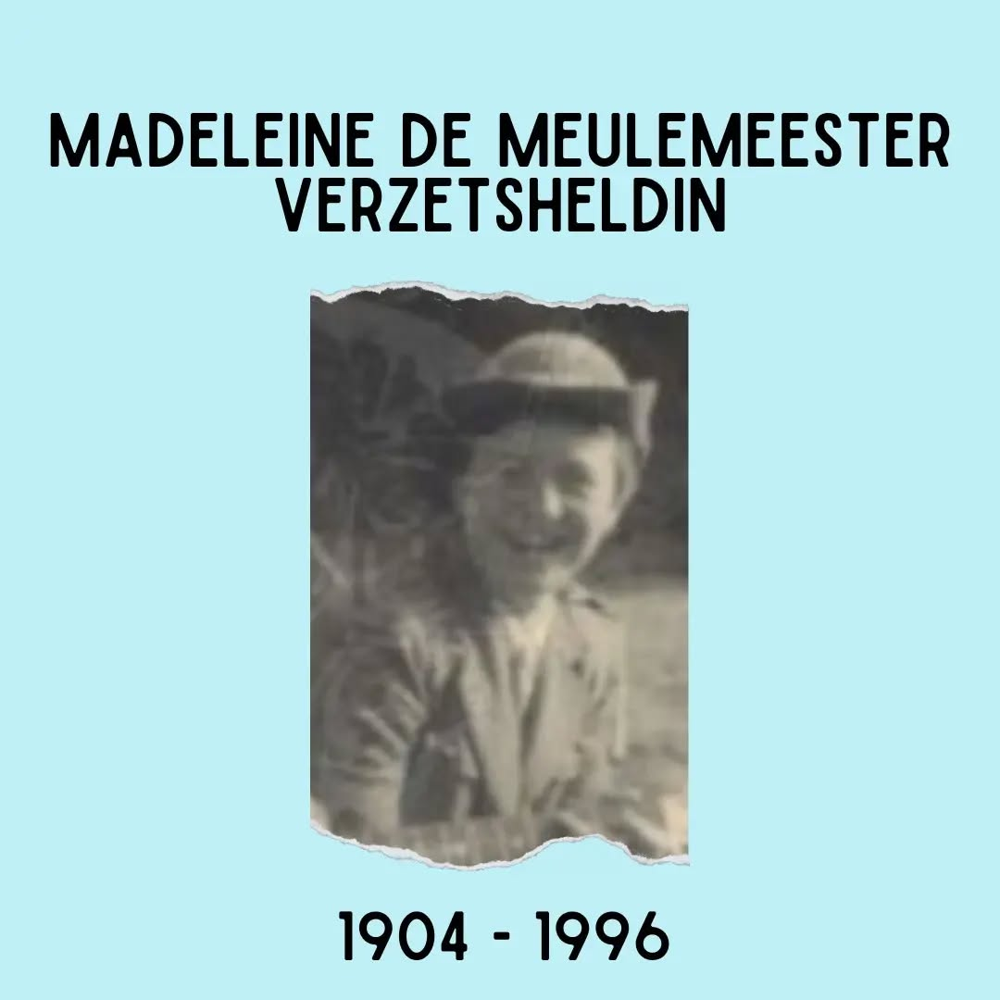

Vandaag 100 jaar geleden is Madeleine De Meulemeester geboren in Brugge. Madeleine is een van de vrouwen die geïnspireerd was door de eerste generatie vrouwelijke rechtenstudenten, en behaalt haar rechtendiploma aan de ULB. Wanneer de Tweede Wereldoorlog uitbreekt, sluit Madeleine zich aan bij het verzet. Ze is niet alleen: met de hulp van haar jongere zus Marcelle - met wie ze samenwoont - verbergt ze joodse kinderen en stelt ze hun huis in Brussel open voor clandestiene radiozenders. Ook haar broers verbergen joodse kinderen, zij het dan in Sint-Kruis. Scoutsmensen (of hoe moet deze groep aangesproken worden?) kennen haar naam misschien omdat Madeleine en haar zus Marcelle een belangrijke rol heeft gespeeld bij de ontwikkeling van de katholieke meisjesgidsenbeweging in België. Madeleine overlijdt op 3 september 1996.

*#ZijWasEens #HeldenVanHetVerzet*

**Bron:** Belgisch Historisch Centrum voor Scouting

