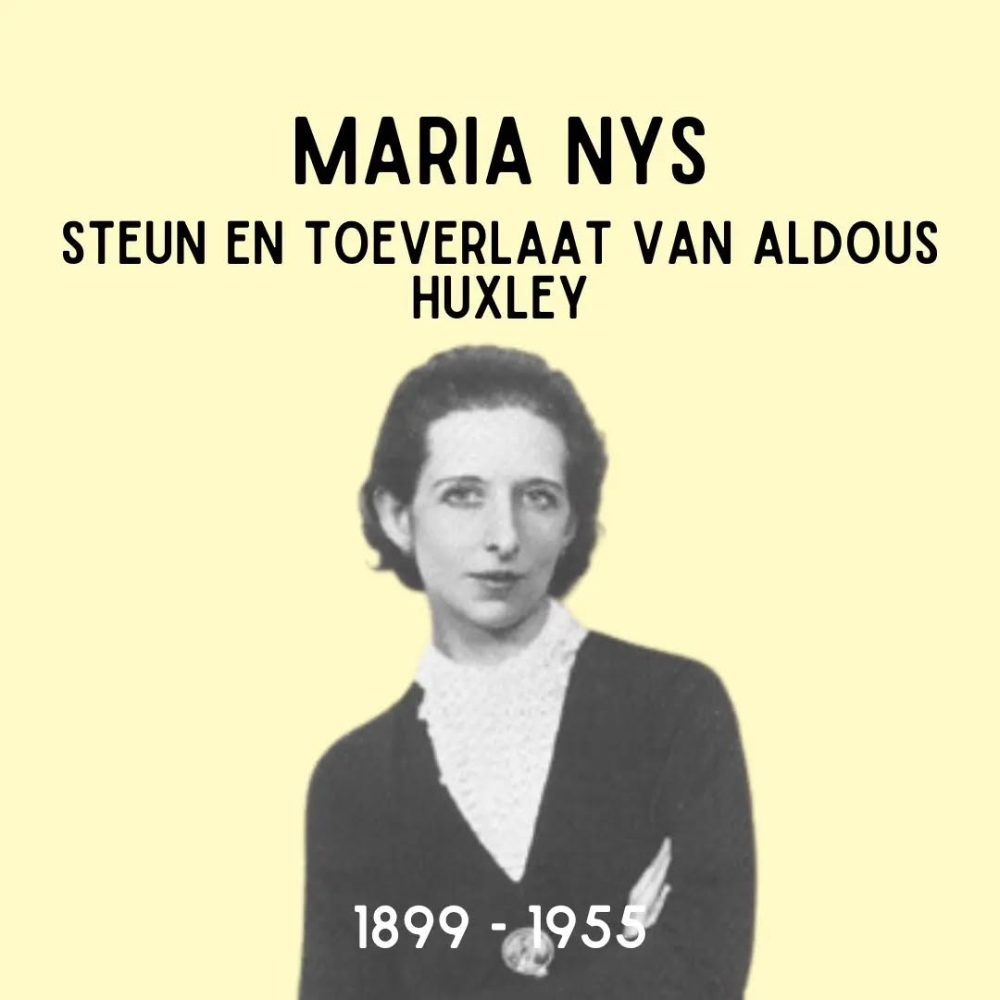
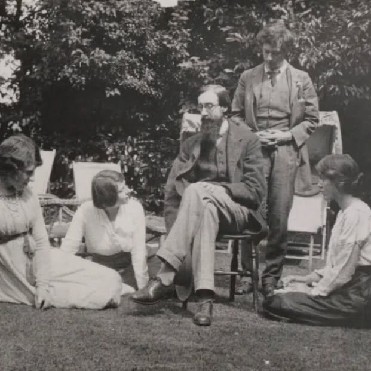

# C_u_IjFt9xk

**Date:** 2024-09-10 13:00:02

## Images

## Caption

Vandaag 125 jaar geleden is Maria Nys geboren in Bellem. Ze brengt een deel van haar leven door in een internaat in Ten Doorn in Eeklo, maar wanneer de eerste wereldoorlog uitbreekt vluchtte ze met haar gezin (haar vader bleef achter om de fabrieken van de familie te beheren) naar Engeland. Het is zo dat Nys in Garsington Manor belandt als 16-jarige, op uitnodiging van Lady Ottoline Morrell, op wie ze een oogje had. Ottoline Morrell had een groepje artistieke mensen rond zich verzameld en in Garsington ontmoet Nys dan ook de schrijver Aldous Huxley met wie ze na hun ontmoeting contact onderhield via brievenpost. Nys en Huxley trouwen op 10 juli 1919 in Bellem. Hun liefde voor elkaar staat vast, maar dit huwelijk heeft ook een beredeneerd component: Nys is biseksueel en kan haar seksualiteit ontplooien dankzij haar open huwelijk met Huxley en Huxley, die bijna blind is op dat moment, heel erg steunt op Nys o.a. voor het neerschrijven van zijn werk. Al snel wordt ze de drijvende kracht achter zijn carrière. We weten bijvoorbeeld dat ze regelmatig feestjes organiseerde waar haar man de kans krijgt om te netwerken met prominente mensen. Hoewel ze in het begin oorspronkelijk in het Verenigd Koninkrijk verblijven, en af en toe richting België reizen voor familiebezoeken, verhuist het koppel na het succes van Huxleys 'Brave New World' naar Hollywood, waar hij als een vedett wordt onthaald. Er zijn verschillende brieven bewaard van Nys gericht aan haar zus over het leven in de VS. Zo ontmoet het koppel Greta Garbo (die Nys omschrijft als "verlegen en neurotisch, maar zo'n mooie vrouw!", Walt Disney, Charlie Chaplin etc. Nys overlijdt in 1955 aan borstkanker. In Sint-Truiden hangt er nog een plakkaat aan de gevel van huis De Roos op de Grote Markt; er wordt aangenomen dat het koppel hier regelmatig verbleef bij de grootmoeder van Maria Nys.

Op de tweede slide zien we links Ottoline Morell met naast haar de jonge Maria Nys in Garsington (foto van de National Portrait Gallery)

