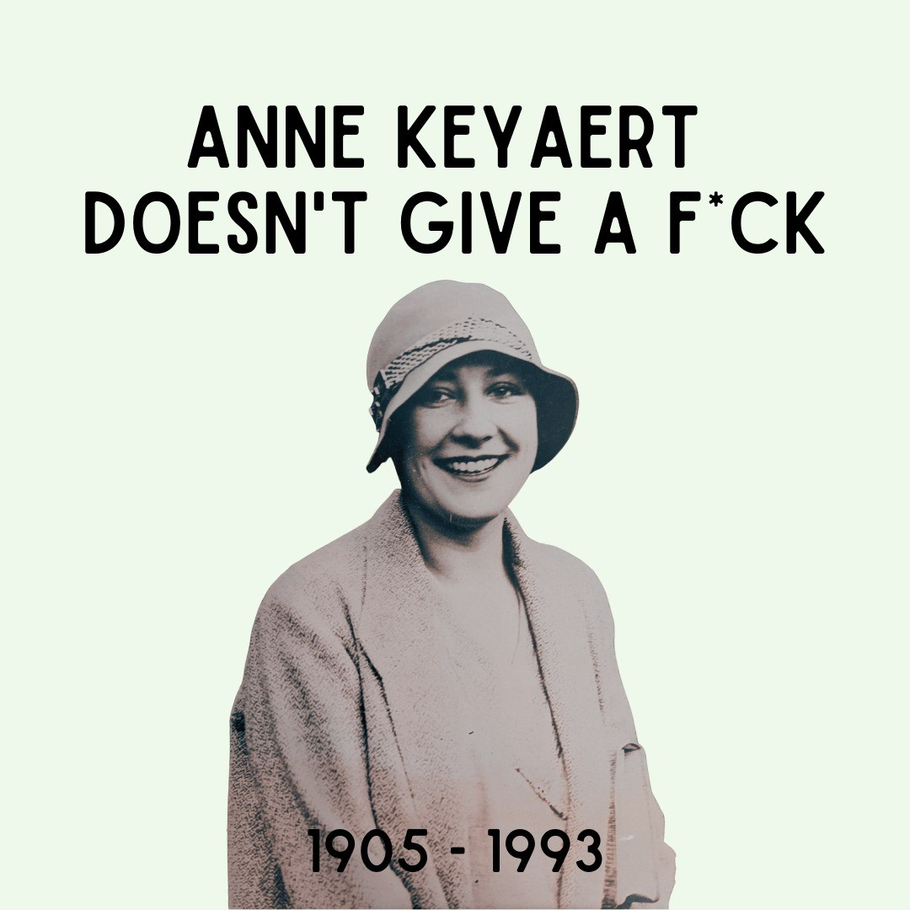
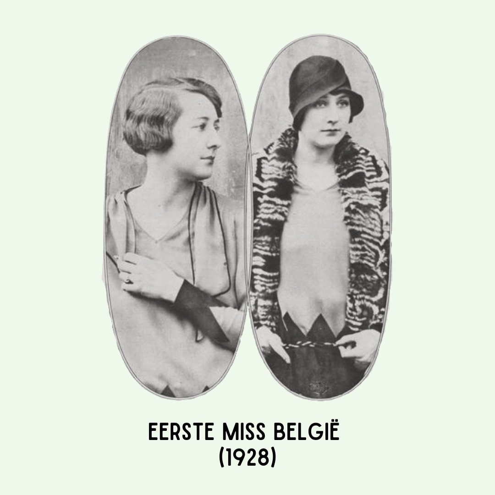
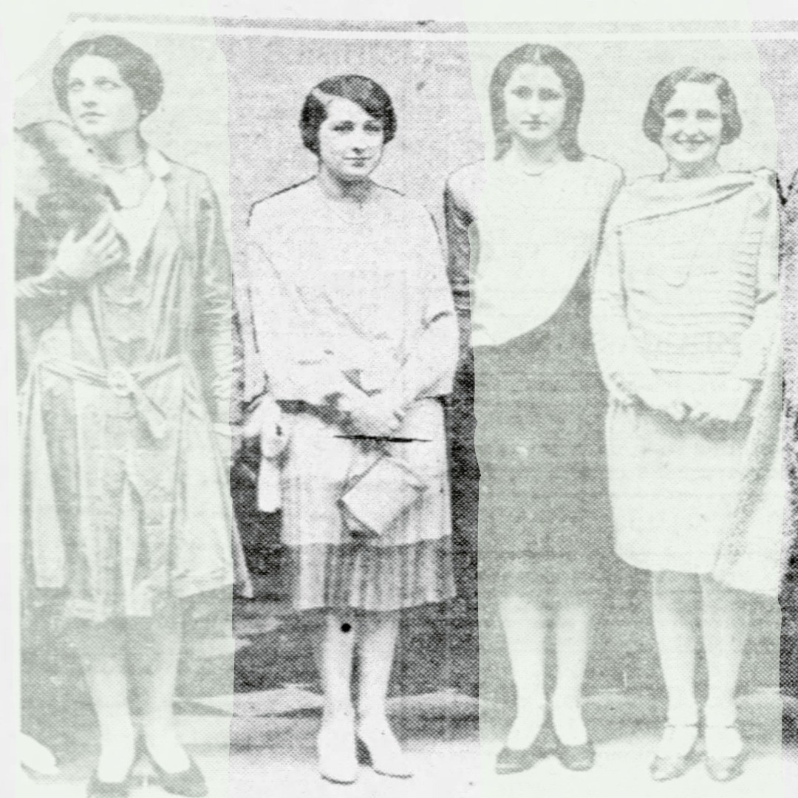
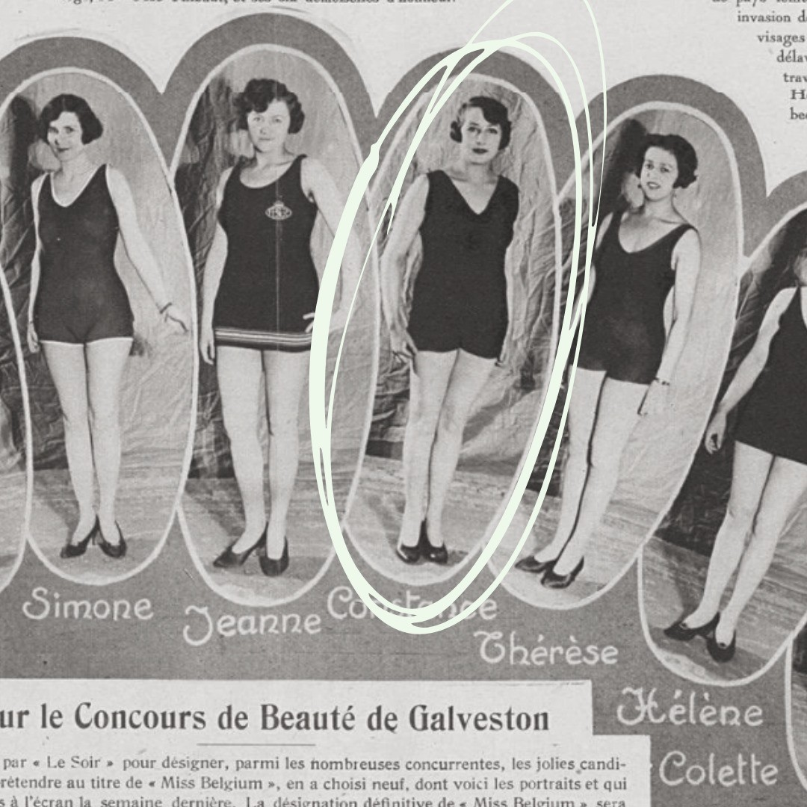

# Cbm2AQ9qMsL

**Date:** 2022-03-27 14:16:09

## Images

## Caption

We pikken in op de actualiteit! Gisteren werd Miss Belgium 2022 verkozen. Gelukkig zijn dit soort verkiezingen tegenwoordig achterhaald en lijkt de massale aandacht jaar na jaar te slinken. Ooit was dit anders. In 1928 lanceert de Belgische krant Le Soir een oproep: ze willen dat ons land meedoet aan de derde editie van Miss Universe in Texas, maar daarvoor moet er in eigen land eerst een Miss België verkozen worden. Dit prikkelt de aandacht van Anne Keyaert, een 23-jarige Vlaams-Brusselse vrouw. Keyaert, die vastberaden is om ten volle te genieten van haar leven, schrijft zich stiekem in voor de wedstrijd. Dankzij haar modellenervaring weet ze al gauw heel wat stemmen te halen en wint ze de titel van Miss België 1928. Een titel die haar niet zozeer boeit, ze is meer geïnteresseerd in het gratis ticket naar de V.S. In het conservatieve Texas wordt Anne, die een wild leven in de Brusselse Anspachlaan gewend is, regelmatig op de vingers getikt: ze wordt gezien met een sigaret, ze flirt te veel met de aanwezige jonge mannen, en - god forbid! - er wordt gezegd dat ze cocktails heeft gedronken in een land waar alcohol op dat moment verboden is. De organisatie van Miss Universe wil haar diskwalificeren, maar doet dit uiteindelijk niet uit respect voor België. Het hoeft geen betoog dat Anne, ondanks dat ze een van de publiekslievelingen was, niet goed scoorde tijdens de wedstrijd en slechts een paar punten wist te sprokkelen bij de jury. 

Anne geeft geen f*ck. Dit is niet bepaald een goede eigenschap, maar voor een vrouw in die tijd enigszins bewonderenswaardig. Meer lezen over de rest van haar markante leven? Klik snel op de link in mijn bio. Trust me, het wordt alleen maar beter 👌

#MissBelgium #AnneKeyaert @lesoirbe #ZijWasEens

