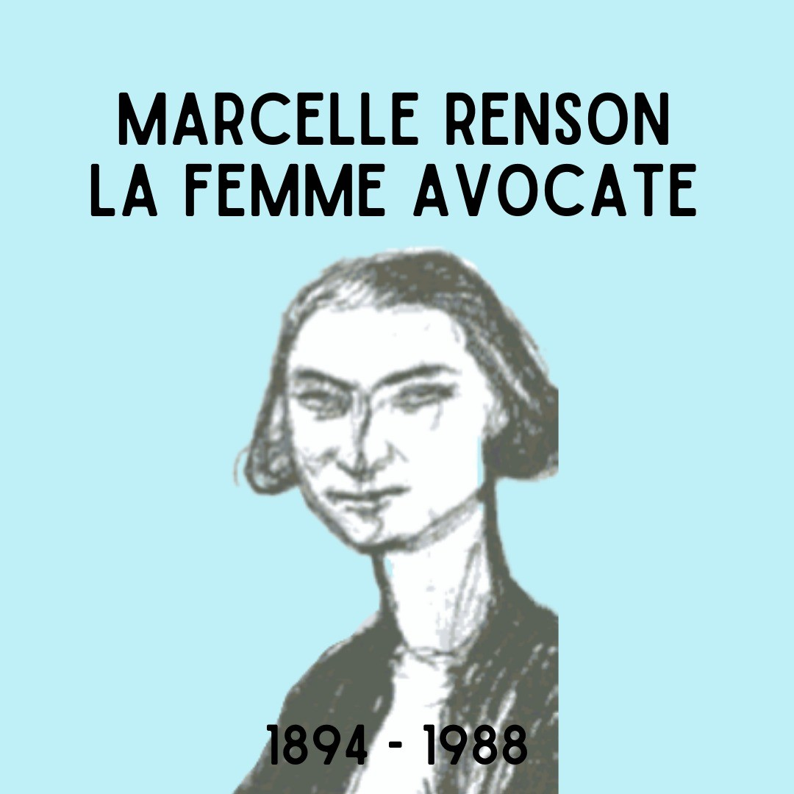
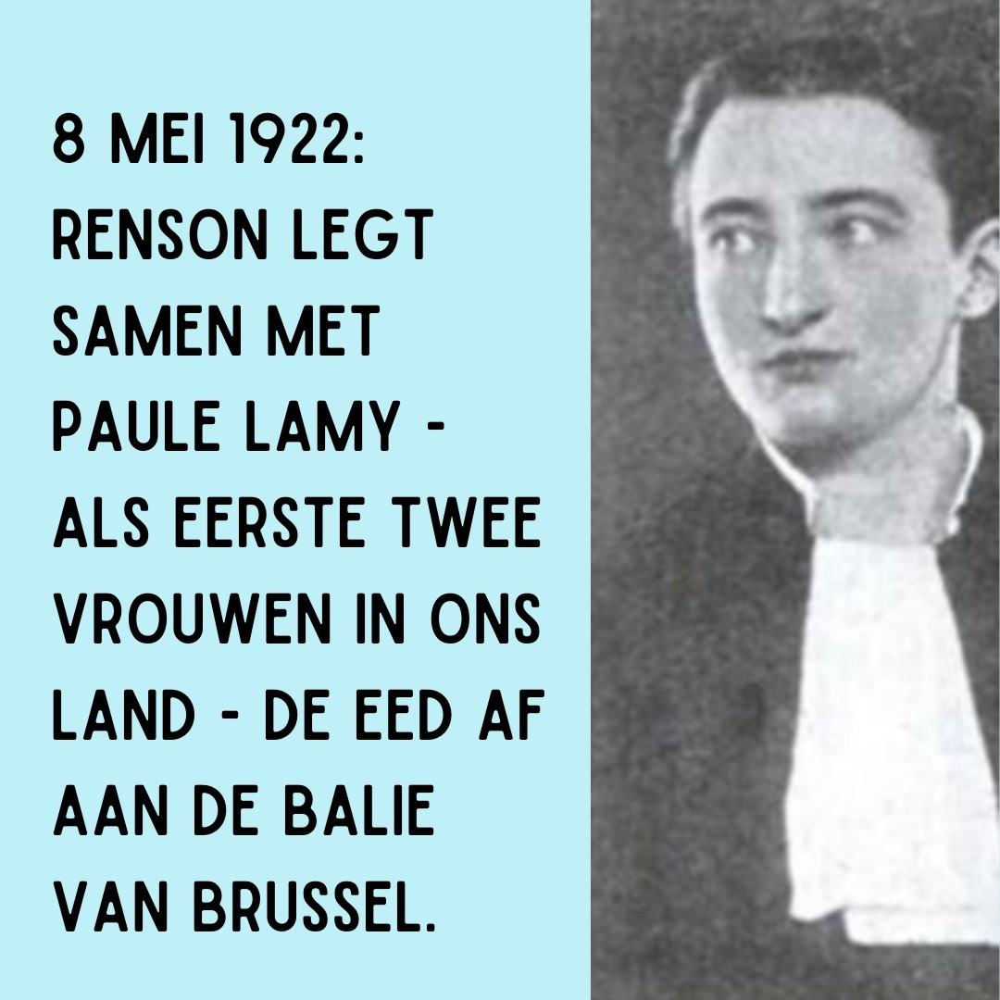

# CbuEt-RqZjt

**Date:** 2022-03-30 09:39:24

## Images

## Caption

Vandaag herdenken we Marcelle Renson! Renson is geboren op 15 maart 1894 en 34 jaar geleden overleden. Je kunt het je misschien niet voorstellen omdat 34 jaar niet zo lang geleden lijkt, maar Renson is een van de eerste vrouwen in België die de advocateneed mocht afleggen. Ze deed dit op dezelfde dag als Paule Lamy. Dit historisch moment in de geschiedenis van België duurde welgeteld 5 minuten! 
Renson schreef zich in 1912 in aan de ULB, maar door het uitbreken van WOI is ze verhuisd naar Parijs, waar ze start aan een opleiding rechten. In Frankrijk mogen vrouwen al sinds 1901 advocaat worden, dus na haar studies kan Renson moeiteloos de eed afleggen. Wanneer ze in 1920 terugkeert naar België wordt ditzelfde haar echter geweigerd. Renson blijft niet bij de pakken neerzitten: ze werkt officieus als jurist bij Lionel Anspach én ze is een van de drijvende krachten achter het wetsontwerp van minister Emile Vandervelde dat in 1922 zal resulteren in de wet die vrouwen toelaat om de advocateneed af te leggen in België. Het moet niet altijd Marie Popelin zijn dat de klok slaat 😊

#ZijWasEens #MarcelleRenson

Illustratie & foto: Dictionnaire des femmes belges

