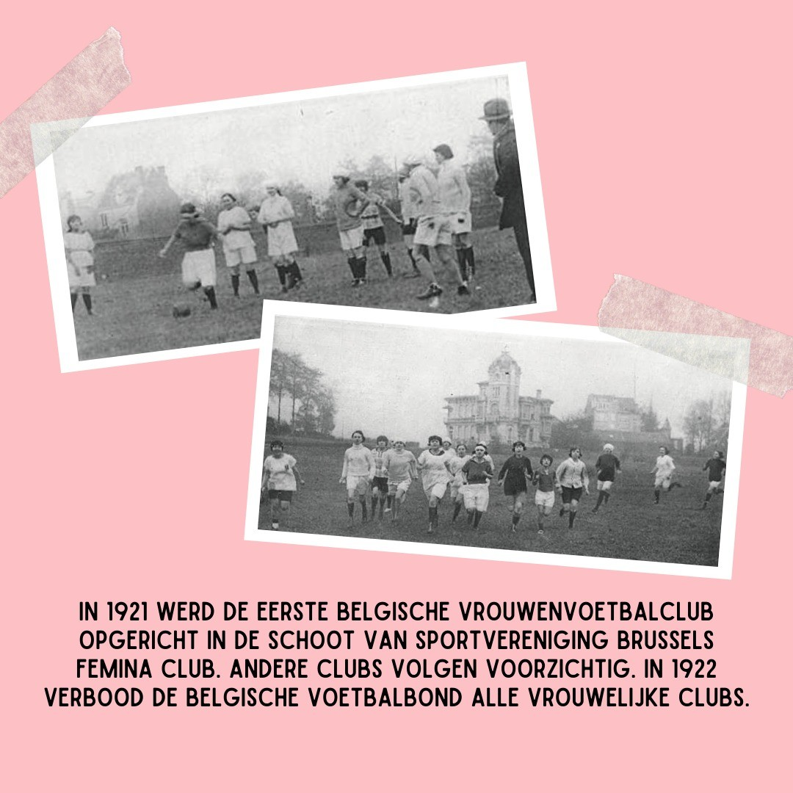
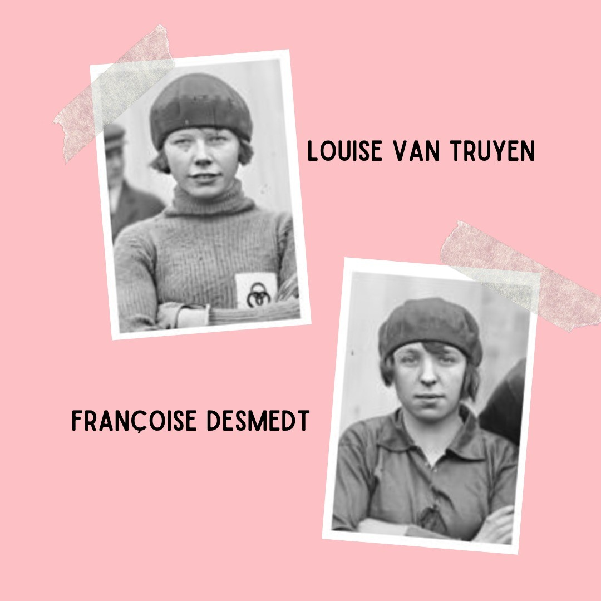

# CchdHdaqC8W

**Date:** 2022-04-19 08:33:52

## Images

## Caption

Met de bekerfinale nog vers in het geheugen, duiken we vandaag in de geschiedenis van het Belgische vrouwenvoetbal. Hiervoor moeten we 101 jaar terug in de tijd. In 1921 wordt in de schoot van de vrouwensportvereniging Brussels Femina Club de eerste vrouwenvoetbalclub opgericht. BFC biedt daarnaast ook atletiek en ritmisch dansen aan aan jonge meisjes en vrouwen uit het Brusselse. BFC krijgt bijval van andere vrouwenclubs, waardoor het ook mogelijk wordt om competities te spelen, zowel nationaal als internationaal. De Koninklijke Belgische Voetbalbond ziet het succes van de vrouwenclubs met lede ogen aan en vaardigt in 1922 een verbod uit: vrouwenvoetbalclubs kunnen zich niet aansluiten bij de voetbalbond en mogen geen gebruik maken van de terreinen van mannelijke voetbalclubs. Clubs die dit wel toelaten, riskeren daarbovenop zelf uitgesloten te worden bij de voetbalbond. Hoewel dit verbod voor de nodige drempels zorgde voor vrouwenvoetbalclubs, worden België en Frankrijk nog steeds gezien als de twee europese landen waar het vrouwenvoetbal relatief vroeg kon floreren. 

#ZijWasEens #BrusselsFeminaClub 

Bron: @bruzzbe, KBR, Helge Faller
Bron beeld: De Geïllustreerde Sportwereld, archief Helge Faller

