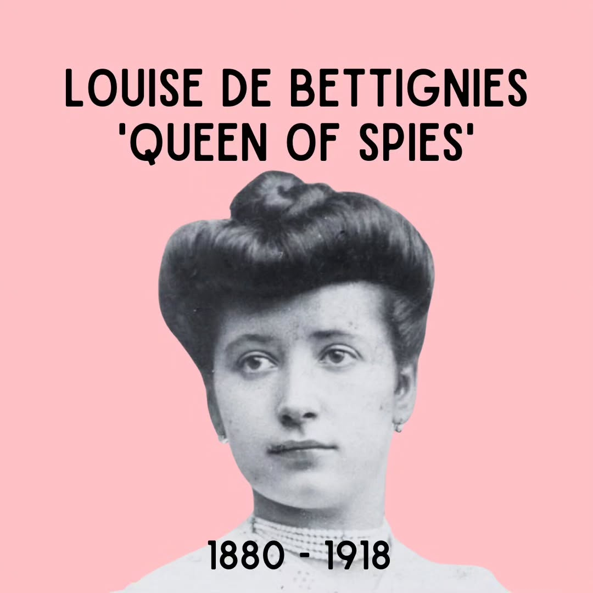

# CuuUvl-tK3C

**Date:** 2023-07-15 17:55:56

## Images

## Caption

Vandaag 143 jaar geleden is Louise de Bettignies geboren. Alhoewel ze in Frankrijk geboren is, gaat de geschiedenis van haar familie terug tot wat nu het grondgebied van België wordt beschouwd. Ze is een telg van een adellijke familie, die op het moment dat zij geboren is echter in financiële moeilijkheden zit. Ondanks die geldproblemen krijgt ze toch de kans om studies aan te vatten. Zo heeft Louise vakken opgenomen aan de prestigieuze universiteiten van Oxford en Cambridge, en haalt ze finaal haar diploma in 1906 aan de Universiteit van Rijsel in Frankrijk. Dankzij haar familienaam kan ze aan de slag als gouvernante bij allerlei rijke, adellijke Europese families. Toch meldt ze zelf dat dit leven niet zo fantastisch was als het leek. Bij het uitbreken van WOI bevindt Louise zich in Frankrijk. Al snel gaat ze, dankzij haar talenkennis, op vraag van de Britse inlichtingendienst MI5 aan de slag als spionne onder de naam 'Alice Dubois'. Ze blijkt hier heel bedreven in en bouwt een gans Alice-netwerk (in het VK noemt men dit netwerk het Ramble-netwerk). Dankzij haar talent in het doorgeven van belangrijke militaire informatie en het smokkelen van mensen naar het VK wordt ze op een gegeven moment 'Queen of spies' genoemd. Fun fact voor de trotse Gentenaren onder ons die vandaag dag 2 van hun Gentse Feesten vieren (tevens de reden waarom deze post zo laat is): haar verzetswerk bracht Louise regelmatig in Gent, waar er een herberg ('De Stad Oudenaarde') stond op de hoek van de Kortrijksesteenweg en de Baliestraat. Deze herberg stond erom bekend een veilige haven te zijn voor verzetslui. 

Op 20 oktober 1915 arresteren de Duitsers haar in Doornik. Ze wordt later, na een proces achter gesloten deuren, ter dood veroordeeld maar er wordt haar gratie verleend en haar straf wordt omgezet naar levenslange dwangarbeid. Toch overlijdt ze in 1918 in Keulen aan slecht behandelde kanker. Ze zou een zeer pijnlijke dood gestorven zijn, en zou zelfs gezegd hebben dat ze liever de kogel had gekregen dan deze pijn te moeten ervaren.

Bron beeld: France24
Bron tekst: biografie Gabrielle Petit (Sophie De Schaepdrijver), artikel 'Edith Cavell in Gent' (Arthur De Decker), wikipedia

