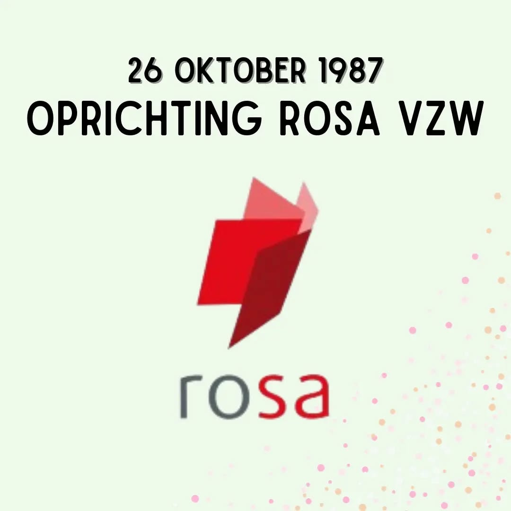

# Cy3Ozubtv_g

**Date:** 2023-10-26 15:02:48

## Images

## Caption

Vandaag blaast @rosavzw 36 kaarsjes uit! In de nasleep van de tweede feministische golf richtten Renée van Mechelen en Chris Zwaenepoel het Documentatiecentrum Rol en Samenleving op. De organisatie verzamelt informatie rond genderongelijkheid en heeft ondertussen een knappe bibliotheek aan materiaal aangelegd. Langsgaan bij het kenniscentrum is vrij, de bibliotheek bevindt zich in de Zennestraat in Brussel. Ook op hun website kan je heeeeel veeeel materiaal rond gender en feminisme vinden. Een broodnodig initiatief, ook vandaag nog 🙏

