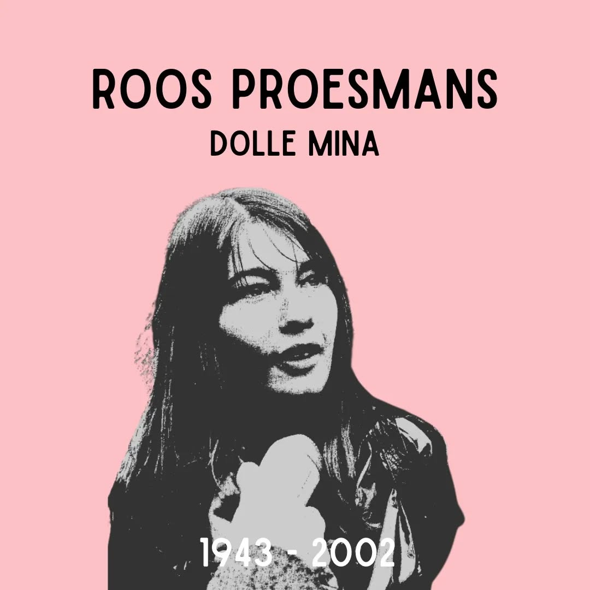

# DATAxgPtmIZ

**Date:** 2024-09-24 12:47:01

## Images

## Caption

Vandaag 81 jaar geleden is Roos Proesmans geboren in Sint-Truiden. Proesmans groeit op in Herent en gaat vervolgens richting Gent om er rechten te studeren aan de rijksuniversiteit. Een paar jaar na haar afstuderen belt ze haar studiegenote Chantal De Smet op: Proesmans zag de opkomst van de Dolle Mina's in Nederland en wilde iets gelijkaardigs uit de grond stampen in België. Ze lanceert een oproep in de krant en tientallen geïnteresseerden verzamelen zich in 1969 in haar woonkamer: de Vlaamse Dolle Mina's zijn geboren. Een van hun eerste acties voor gelijkheid tussen mannen en vrouwen vindt plaats in het verzekeringskantoor waar Proesmans werkt. Enkel mannen mochten hier roken. Onder het mom van 'Vrouwen hebben ook recht op longkanker' is dit initiatief het startsein van verschillende ludieke acties om vrouwenrechten op de agenda te plaatsen. De enkele vrouwelijke politici die op dat moment actief zijn durven namelijk geen vrouwelijke thema's naar voor te schuiven uit angst om gezien te worden als hysterisch. Hoewel de Dolle Mina's een kort leven beschoren zijn, zijn ze wel de katalysator van de tweede feministische golf in Nederland en België, een broodnodige zweepslag voor het beleid en de bestaande structuren. De erfenis van Proesmans en haar Dolle Mina's zien we vandaag nog steeds terug in verschillende organisaties die in hun kielzog zijn ontstaan. Proesmans overlijdt in 2002 op 59-jarige leeftijd aan de gevolgen van kanker. In 2013 eert stad Gent haar met een Roos Proesmansstraat in Oostakker. 

Bron: Brood en Rozen, De Morgen

