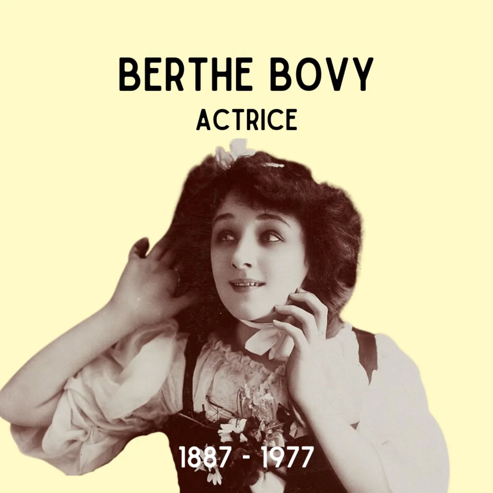

# DEe9KLlN6rj

**Date:** 2025-01-06 13:11:54

## Images

## Caption

Vandaag 138 jaar geleden is Berthe Bovy geboren in Cheratte (Luik). Deze naam doet voor velen geen belletje rinkelen, toch wordt Berthe - met een carrière van meer dan 60 jaar achter de kiezen - beschouwd als 'la plus grande comédienne belge'. Berthe is de dochter van Théophile Bovy, dichter en journalist (én auteur van het Waalse volkslied). Ze toont op erg jonge leeftijd interesse in acteren, en - aangemoedigd door haar vader - doet ze al op zesjarige leeftijd mee aan een aantal theaterproducties. Een Disneykindsterretje avant la lettre! Op haar dertiende schrijft ze zich in aan het Koninklijk Conservatorium in Brussel, om vervolgens haar studies verder te zetten aan het Conservatorium van Parijs. Op 1 januari 1920 wordt ze lid van de Comédie-Française, 7 jaar nadat ze er debuteerde. De Comédie-Française is een prestigieus staatstheater in Parijs waar vrijwel alle belangrijke toneelspelers in de geschiedenis van Frankrijk aan verbonden zijn geweest. Een hele eer voor deze Liégoise! Nog eervoller is de reden waarom ze wordt buitengebonjourd bij de Comédie-Française: Berthe weigerde in 1942 deel te nemen aan een tournee door Duitsland. Na de oorlog treedt ze terug toe tot het gezelschap, waar ze tot 1963 actief zal blijven. Vier jaar later staat ze een laatste keer op de planken - op tachtigjarige leeftijd. Berthe overlijdt op 26 februari 1977.

#ZijWasEens #BertheBovy

