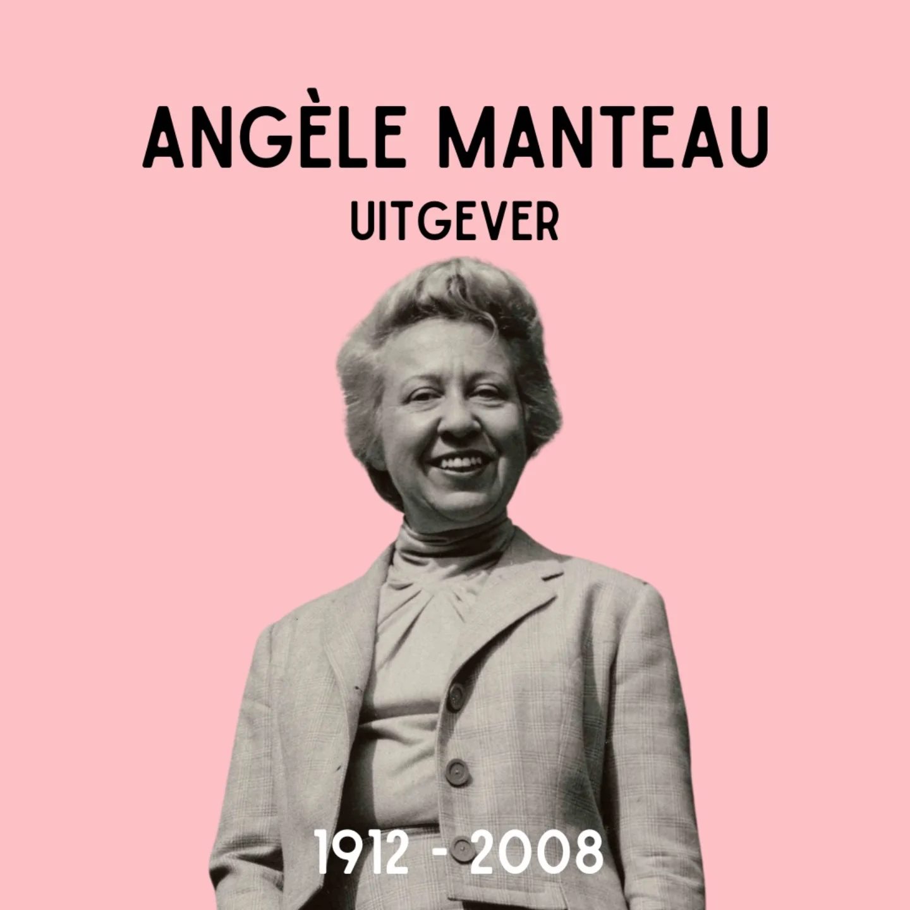

# DFN5Z2wtJlB

**Date:** 2025-01-24 18:43:24

## Images

## Caption

Vandaag 113 jaar geleden is Angèle Manteau geboren in Dinant. 

Ze verliet het nest om scheikunde te studeren aan de ULB. In Brussel leert ze het echtpaar Jan Greshoff en Aty Brunt kennen, die op zoek zijn naar een inwonend Franstalig meisje. Bij dit gezin leert Angèle Nederlands. Ze maakt er ook kennis met Greshoffs buurman Alexander Stols, een Nederlandse drukker-uitgever wiens secretaresse ze werd. Goed gezien, want wanneer Stols de boeken wil dichtdoen in België en wil terugkeren naar Nederland, neemt Angèle zijn kantoor over. De 'Algemeene Importboekhandel A. Manteau' is geboren! 

De zaken lopen goed, en in 1938 kan Angèle zelfs een uitgeverij beginnen. Bij het uitbreken van WOII worden uitgevers in Nederland gehinderd door de Duitse bezetter. Dit is minder het geval in België, waardoor Angèles bedrijf - dat tot voor de oorlog voornamelijk Nederlandse boeken importeerde - de Nederlandse werken zelf kan uitgeven. Door de grote leeshonger bij de bevolking tijdens de oorlog komt er veel geld binnen, wat Angèle de kans geeft om op dat moment onbekende schrijvers als Louis-Paul Boon en Johan Daisne te lanceren. In 1950 geeft ze ook Hugo Claus' romandebuut 'De Metsiers' uit. Toch duurt het verhaal niet lang: in 1965 moet ze omwille van financiële redenen noodgedwongen haar bedrijf onderbrengen in de Haagse uitgeversgroep Van Goor. Met de directie van Van Goor klikt het niet, waardoor Angèle in 1970 haar eigen bedrijf verruilt voor uitgeverij Elsevier. 

Ze wordt in 1986 door de koning tot de adelstand verheven voor haar bijdrage aan de ontwikkeling van het boekenvak in Vlaanderen. Angèle Manteau overlijdt in 2008.

Bron: Encyclopedie van de Vlaamse beweging

#ZijWasEens #AngèleManteau

