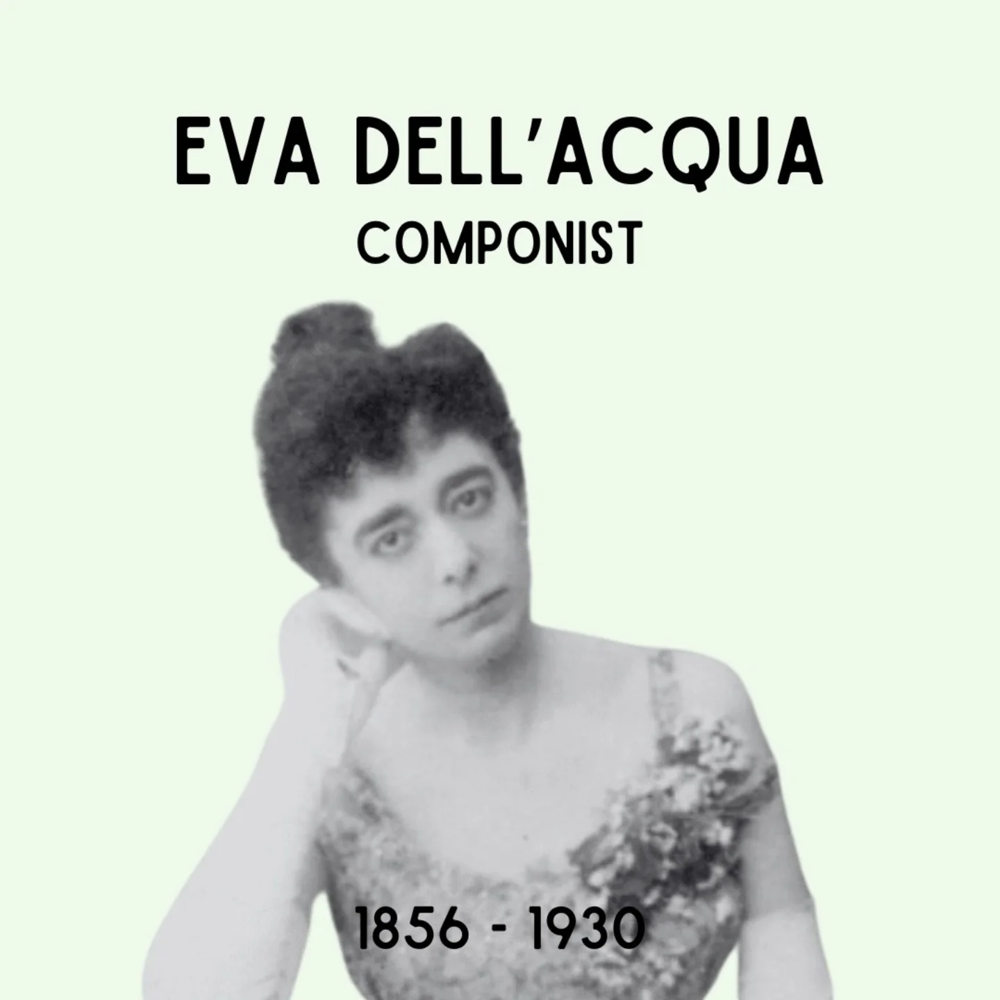

# DFXM1g1NyZQ

**Date:** 2025-01-28 09:26:22

## Images

## Caption

Vandaag 169 jaar geleden is Eva Dell'Acqua geboren in Schaarbeek. 

De ouders van Eva zijn de uit Triëst geïmmigreerde Cesare Dell'Acqua en de Nederlandse Caroline Vander Elst. Haar ouders zijn kunstzinnige mensen: Cesare is een veelgevraagde schilder en haar moeder zingt in een koor. Eva's liefde voor muziek komt alleszins niet als een verrassing, gezien de artistieke omgeving waarin haar gezin vertoeft. Ze krijgt privélessen en gaat later ook zelf aan de slag als zanglerares in Brussel en Antwerpen. Eva blinkt uit in verschillende artistieke domeinen: als componist, dichter, actrice en zangeres. Ze brengt haar gecomponeerd werk ook regelmatig zelf in intieme salons in haar omgeving. 

Toch zal Eva nooit de bekendheid verwerven van haar mannelijke collega's. Op haar overlijdensakte staat 'zonder beroep' vermeld. Hoewel Eva's naam gekend was in artistieke kringen, zal ze wellicht nooit veel geld verdiend hebben met haar werk, die ze eerder in de intieme kringen van artistieke salons bracht dan op grote podia en in bekende theaterhuizen. "Het was voor dell'Acqua [...] quasi onmogelijk om orkestwerken uitgegeven en uitgevoerd te krijgen. Werken met een sterk thematische ontwikkeling (genres als sonates, symfonieën en concerto's) werden als masculien en viriel beschouwd en dus voor een componerende vrouw als tegennatuurlijk."

Eva overlijdt op 12 februari 1930 in Elsene.

#ZijWasEens #EvaDellAcqua

Bronnen: Crescendo Magazine, Ronnydeschepper.be

