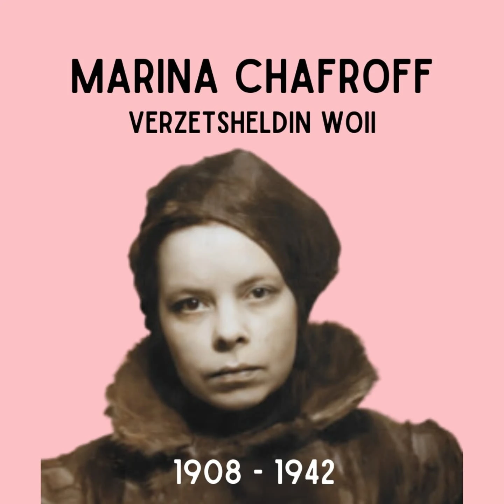
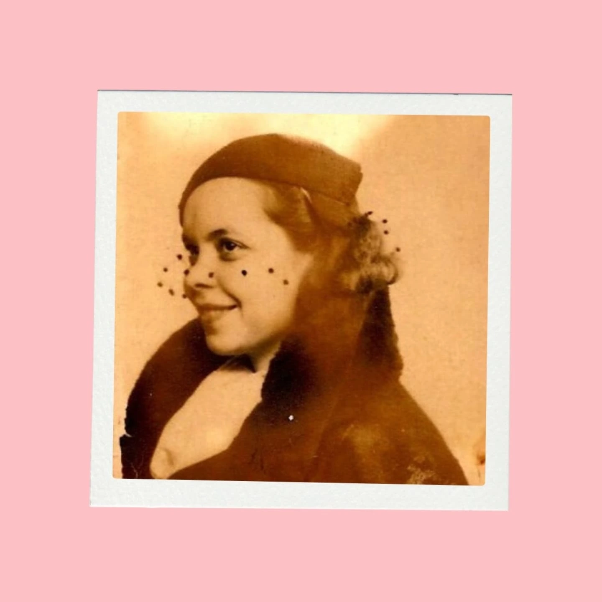
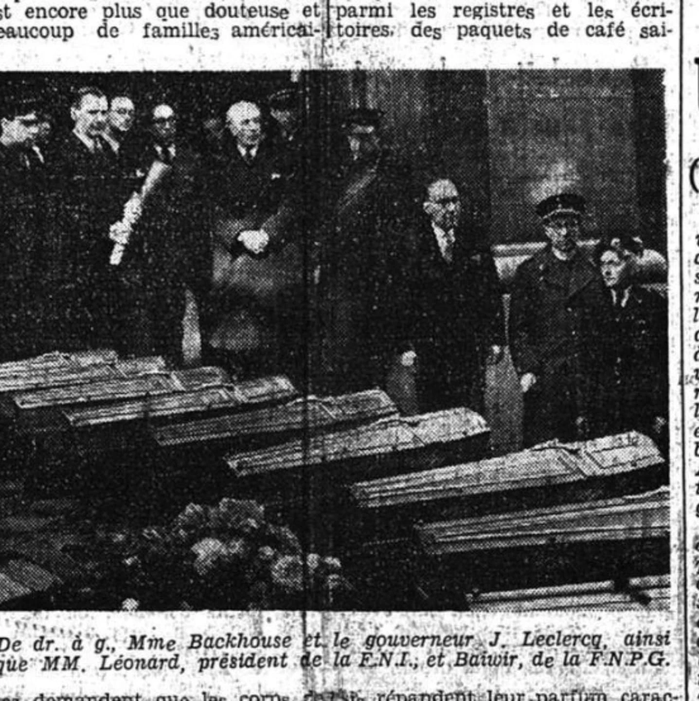

# DFe1VN_tFdl

**Date:** 2025-01-31 08:34:54

## Images

## Caption

Vandaag 83 jaar geleden is Marina Chafroff onthoofd in Keulen. 

Marina is geboren op 28 februari 1908 in Liepaja, toen Russisch gebied, vandaag Letland. Ze behoort tot een vooraanstaande Russische familie. Haar vader werkt voor de keizerlijke marine. Bij het uitbreken van de revolutie gaan veel mensen op de vlucht. In 1928 brengt dit Marina en haar gezin naar België. Hier leert ze ook haar toekomstige echtgenoot Youra (Georges) Maroutaeff kennen. 

Het koppel is tijdens de bezetting actief in het verzet. Toch klaagt Marina over hoe soft het verzet er aan toe gaat in die tijd, ze vindt het niet kunnen dat de Duitse bezetter zich relatief veilig voelt op de straten in Brussel. Op 7 december 1941 wordt een Duitser in uniform neergestoken aan de Avenue Marnix. De dader weet te ontsnappen en de Duitsers treden hardhandig op: 60 mensen worden opgepakt en zullen geëxecuteerd worden als de dader niet bekent. De - letterlijke - deadline hiervoor is 15 december om 20u. Die dag, maar om 18u verwondt Chafroff met haar mes een Duitser op de Avenue Adolphe Max. Ze zorgt ervoor dat zij de enige verdachte is en niet kan ontkomen. Wanneer ze ondervraagd wordt bekent ze dat zij ook verantwoordelijk was voor de moord op Avenue Marnix. De 60 gijzelaars worden vrijgelaten. Tot op de dag van vandaag is het nog steeds onduidelijk of Marina effectief verantwoordelijk was voor de moord op Avenue Marnix, of zichzelf heeft opgeofferd om het leven van 60 mensen te redden. 

Wat ook de waarheid is, haar daad zorgt voor heel wat sympathie bij de bevolking in Brussel, die elke dag bloemen brengt naar de Sint-Gillis gevangenis waar ze vast zit. Om onrust te vermijden wordt besloten haar niet te executeren in Brussel, maar haar over te brengen naar Keulen. De clementieverzoeken van Koningin Elisabeth mochten niet baten en Marina wordt hier op 31 januari onthoofd. Haar lichaam belandt in een onbekend graf.

Na de oorlog beveelt Koningin Elisabeth dat haar lichaam teruggebracht wordt naar België. In mei 1947 wordt Marina gerepatrieerd en begraven op het kerkhof van Elsene. 

Saillant detail: Marina's tante langs moederszijde is de Sovjet-schutter Nina Petrova. 

#ZijWasEens #MarinaChafroff

