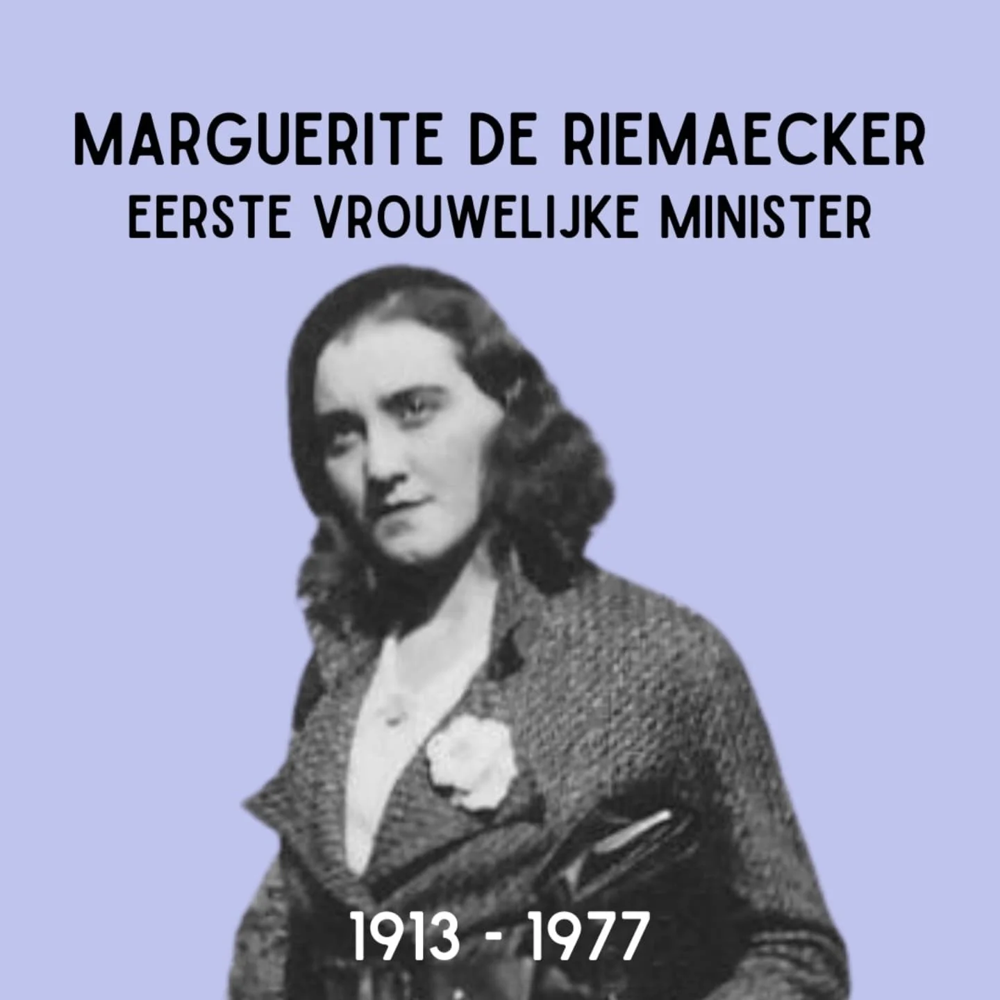
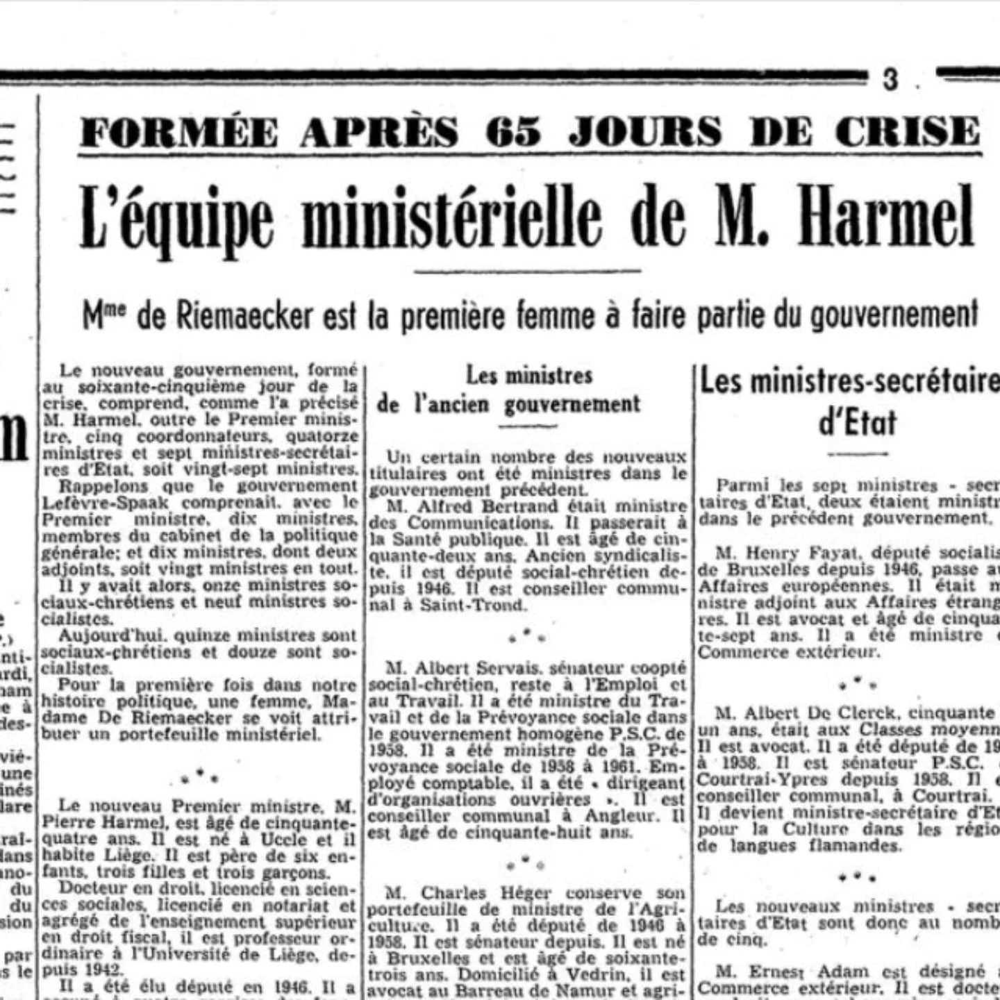
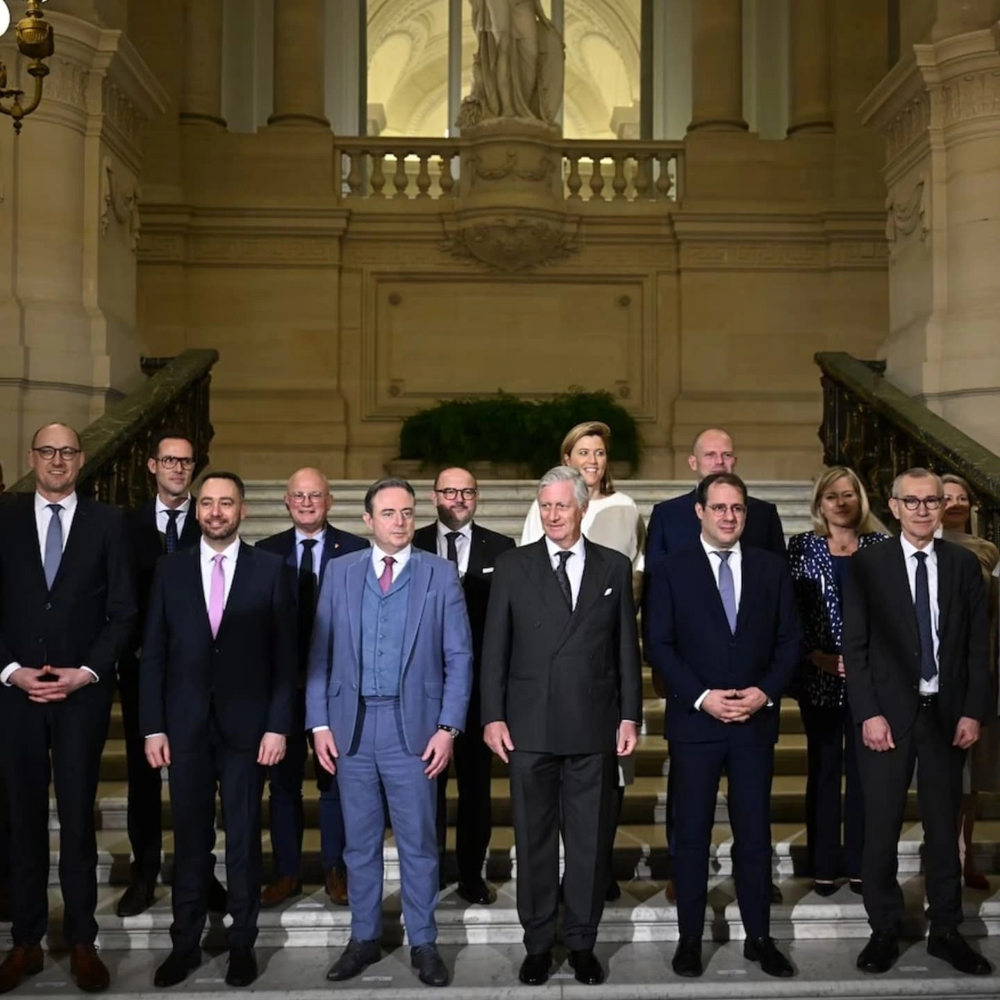

# DFnXJwHNkes

**Date:** 2025-02-03 16:04:21

## Images

## Caption

Slechts een op de vier ministers in onze gloednieuwe federale regering is vrouw. 

Op 9 maart 1913 is Marguerite Legot geboren in Oudenaarde. Voor haar studies komt ze terecht in Gent: middelbaar onderwijs in @nieuwenboschhumaniora en daarna rechtsgeleerdheid aan de @ugent. Na haar studies gaat ze aan de slag in Brussel op het kantoor van Pierre Nothomb in Brussel. Hier ontmoet ze Maria Baers, boegbeeld van het christelijk feminisme. Marguerite wordt secretaris van haar politiek kabinet. 

De politiek lijkt meer haar ding dan de advocatuur. In 1946 wordt ze voor de CVP verkozen als volksvertegenwoordiger in de kamer. Hier maakt ze werk van wetsvoorstellen die de positie van vrouwen moeten verbeteren. Haar naam staat onder tientallen wetsvoorstellen... én wetsontwerpen; want in 1965 wordt ze minister van Gezin en Huisvesting in de regering Harmel. Ze is de eerste vrouwelijke minister van België. 

Marguerite De Riemaecker-Legot overlijdt op 7 mei 1977 in Brussel. 

#ZijWasEens #MargueriteDeRiemaeckerLegot

Bronnen: UGentMemorie

