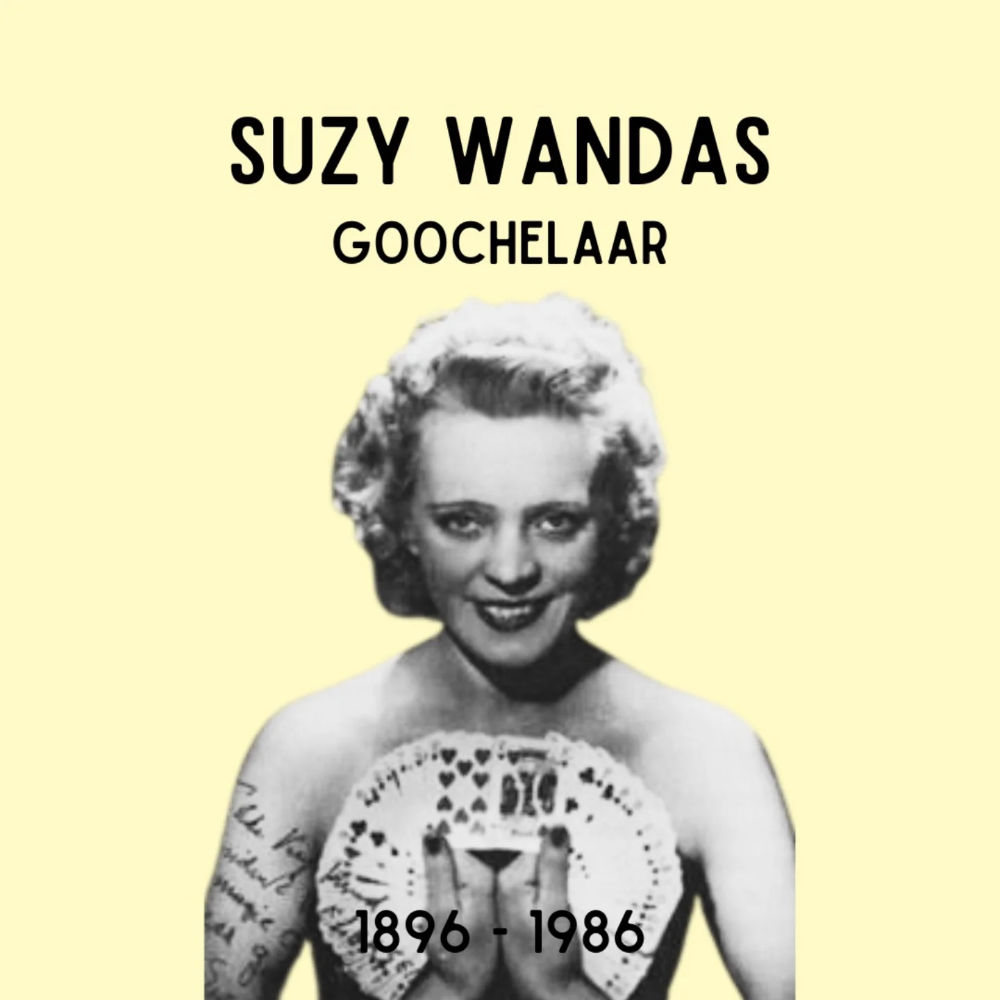

# DG0Lhd4NHMu

**Date:** 2025-03-05 12:04:15

## Images

## Caption

Vandaag 129 jaar geleden is Jeanne Van Dyk geboren. Haar ouders zijn circusartiesten en Jeanne ziet het levenslicht in een foorwagen op de site van Thurn en Taxis, waar het circus van haar vader en diens halfbroer op dat moment stand houdt. 

Geïnspireerd door haar omgeving begint Jeanne op jonge leeftijd al verschillende goocheltrucs te oefenen. Wanneer ze dertien is, overlijdt haar vader. Niet lang daarna breekt ook WOI uit. Haar broer strijdt mee in het Belgische leger. Jeanne trekt samen met haar moeder naar Italië, waar ze blijven optreden. Haar moeder heeft een jeugdig uiterlijk, dus hun artiestennaam wordt 'The Wanda's Sisters'. Na de oorlog keren moeder en dochter terug naar Brussel, hun uitvalbasis tussen de vele tournees doorheen heel Europa door. Jeanne blijkt echter zo getalenteerd dat ze vanaf 1936 solo gaat. Ze kiest de naam Suzy Wandas, naar het nummer 'If you knew Susie'. Ze wordt ook wel het meisje met de feeënvingers genoemd, omdat ze haar trucs langzaam en elegant uitvoert. 

Na WOII wordt ze door enkele Amerikanen ontdekt wanneer ze op een goochelcongres aan het werk is. Hier start Suzy's American Dream: ze treedt op in de V.S., leert de liefde van haar leven kennen op de planken en trouwt met hem op zestigjarige leeftijd. Na een afscheidstournee zegt ze België voorgoed vaarwel. 

In 1981 krijgt ze de gerenommeerde Performing Fellowship Award van de Academy of Magical Arts. Ze is de eerste Belg die deze prijs krijgt. De kers op de taart van haar bruisende carrière. Suzy Wandas overlijdt op 12 juli 1986 in Detroit, Michigan.

Bronnen: @huisvanalijn @kobevanherwegen

#ZijWasEens #SuzyWandas #SleightOfHands #Cardistry

