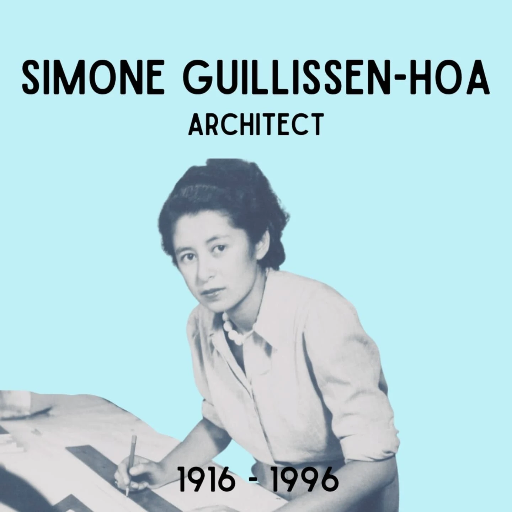
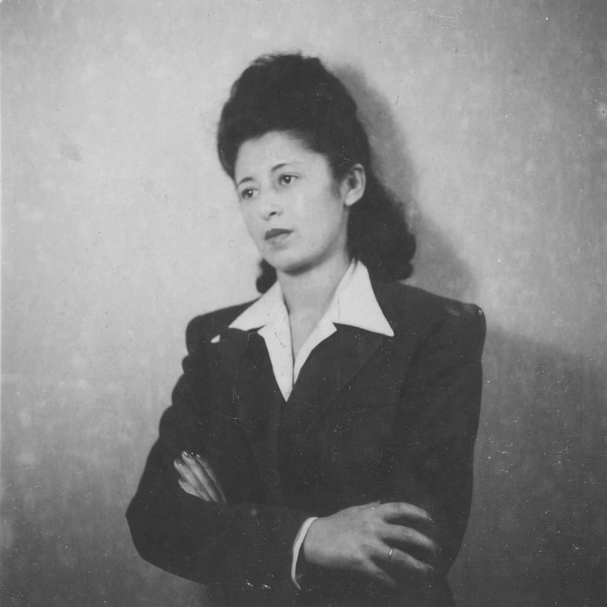
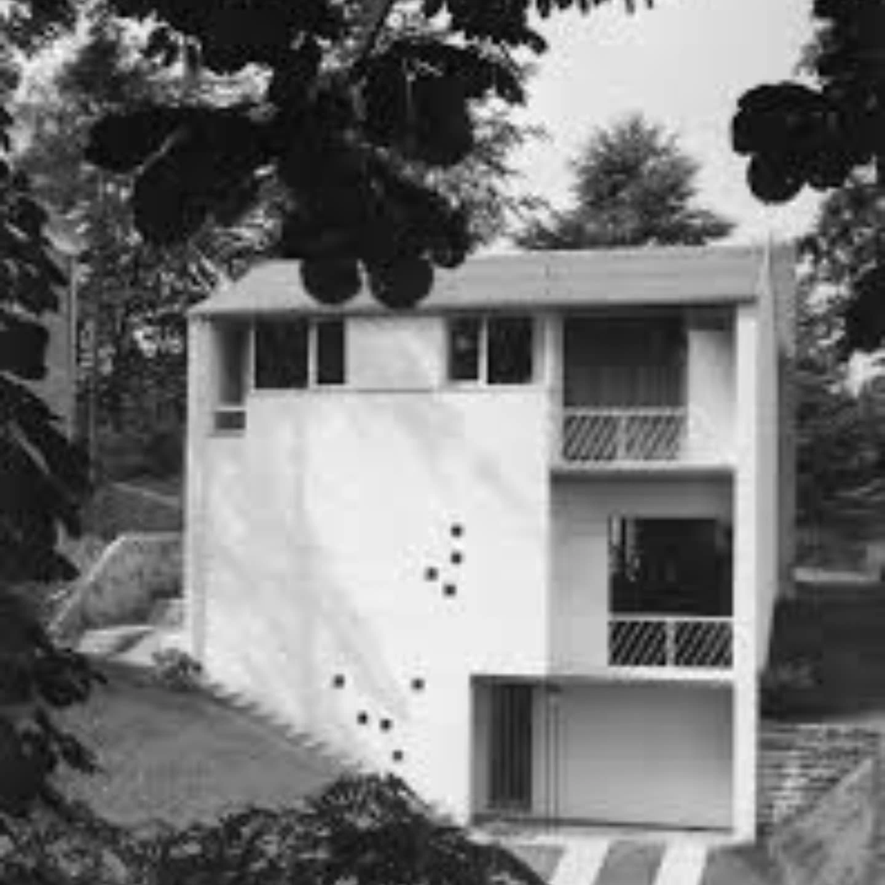

# DG5bfDCNmC6

**Date:** 2025-03-07 12:59:56

## Images

## Caption

Vandaag 109 jaar geleden is Simone Hoa geboren in Beijing, China. 

Haar vader is een Chinese ingenieur, haar moeder een Pools-joodse schrijfster. In 1932, en na een verblijf in Frankrijk en Engeland, verhuist ze naar Brussel. Simone werkt haar middelbare studies af aan het Lycée Dachsbeck en schrijft zich daarna in voor de architectuuropleiding aan de prestigieuze kunstschool La Cambre in Brussel. Ze krijgt les van Henry Van De Velde en is in 1938 de vierde vrouw die hier afstudeert in architectuur. Ze is tevens de eerste vrouw in België die een eigen architectuurkantoor opricht. Ze is de enige vrouw op dat moment die mensen in dienst heeft en regelmatig in architectuurtijdschriften verschijnt. Simone onderscheidt zich met innovatieve, modernistische ontwerpen, geïnspireerd door o.a. Le Corbusier. 

Samen met haar echtgenoot, de ingenieur Jean Guillissen, zet ze zich tijdens de Spaanse Burgeroorlog in voor de kant van de Spaanse republikeinen. Jean en Simone, op dat moment gescheiden, zetten zich ook in in het verzet in België tijdens WOII. Dit is niet zonder risico's voor Simone, die communistische sympathieën en Chinese en joodse roots heeft. Door haar verzetsactiviteiten belandt ze twee jaar in de concentratiekampen Dachau en Ravensbrück. 

Na de oorlog herneemt ze haar werk als architect in Brussel en voedt ze als alleenstaande moeder haar zoon, geboren in 1950 uit een kortstondige relatie, op. We herinneren Simone Guillissen-Hoa als een modernistisch pionier in de door mannen gedomineerde architectuurwereld en een voorvechter van vrouwenrechten (niet in het minst de rechten van vrouwelijke architecten). 

#SimoneGuillissenHoa #ZijWasEens 

Bron: Bruzz, CIVA

@untold.asian.stories

