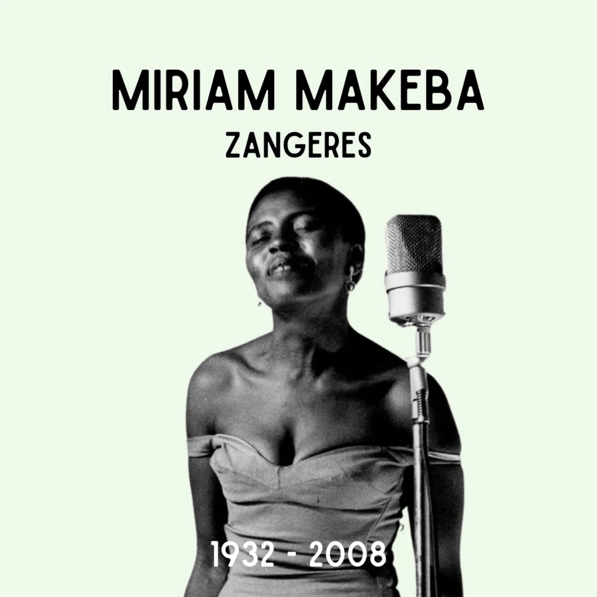

# DGx_Q0ANYuL

**Date:** 2025-03-04 15:38:39

## Images

## Caption

Vandaag 93 jaar geleden is Miriam Makeba geboren in Johannesburg, Zuid-Afrika. 

Miriam breekt door met haar muziek in de jaren 50. Haar talent brengt haar op tournees doorheen Europa en de V.S. Door haar anti-apartheidsactivisme wordt haar Zuid-Afrikaans staatsburgerschap afgenomen. Miriam woont hierna in de V.S., en een periode in Guinee. Ze trouwt met Baegeot Bah, die een hoge functie bij Sabena heeft. Dit huwelijk brengt haar naar Brussel. Zelfs in de Matongéwijk is men er niet van op de hoogte dat 'Mama Africa' in ons land woont. Dankzij de luchthavenverbinding in Brussel kan Miriam makkelijk blijven touren: in 1987 vergezelt ze Paul Simon die voor zijn Graceland-tournee wil samenwerken met zwarte artiesten. Miriam haalt ook Nina Simone naar Brussel: in een studio vlakbij Koekelberg nemen de twee dames hun versie van Bob Dylans 'I shall be released' op. Een bijzonder moment. 

In 1990, wanneer het apartheidsregime gevallen is, vraagt de net vrijgelaten Nelson Mandela of Miriam wil terugkeren naar Zuid-Afrika, wat ze altijd al wilde en dus doet. Pittig detail: Miriam wil niet met lege handen terugkeren en zoekt een geschenk voor Mandela in de chique Louizalaan in Brussel. In een van die winkels wordt haar gezegd dat het er wellicht te duur zal zijn voor haar. Ze legt de spullen die ze heeft gekozen op de toonbank en haalt een stapel bankbiljetten uit haar zak en zegt: 'Of nee, ik ga die toch niet hier kopen. Maar u kunt wel mijn kleren terughangen.' 

Het anti-apartheidsactivisme heeft Miriam overigens van geen vreemde: haar moeder baatte een shebeen uit. Dit is een ondergrondse bar waar Zuid-Afrikaanse activisten verzamelen om maïsbier te drinken en over politiek te praten. Twee weken na Miriams geboorte wordt haar moeder opgesloten in de gevangenis. Miriam zal haar eerste levensmaanden in de gevangenis doorbrengen. 

#ZijWasEens #MiriamMakeba

