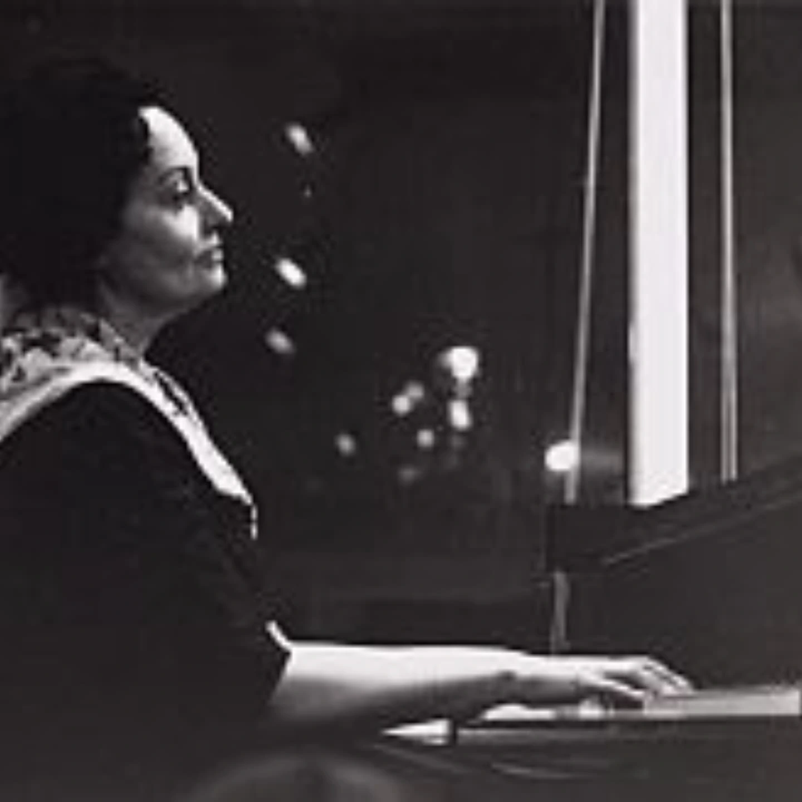

# DHDcLJct_q-

**Date:** 2025-03-11 10:18:22

## Images

## Caption

Vandaag 114 jaar geleden is Ida Rosenheimer geboren in Antwerpen. Haar vader is een Duitser, haar moeder Nederlands-Engels. Bij het uitbreken van WOI verhuist het joodse gezin naar Scheveningen in Nederland. 

Toch blijft Ida Antwerpen een warm hart toe dragen. Het is ook hier dat de getalenteerde pianiste zal debuteren in het Cercle Musical Juif in 1930. Haar carrière verloopt hierna glansrijk, tot WOII uitbreekt. Dankzij haar man, David Simons, met wie ze in 1933 in het huwelijksbootje treedt, belandt het gezin Simons op een lijst met geprivilegieerde joden. Op deze lijst staan prominente joden uit het bedrijfsleven, academia of cultuur die een belangrijke bijdrage leveren aan de Nederlandse samenleving. Dit geeft hen even bescherming, maar het gezin belandt in 1943 in Westerbork en in 1944 in Theresienstadt. Ida blijft piano spelen in deze kampen. 

Het gezin overleeft de holocaust, maar Ida is fysiek en psychisch aangetast. Haar comeback als pianiste verloopt ook moeilijker dan gedacht. Halverwege de jaren vijftig besluit ze dan ook niet meer op te treden. Een carrièreswitch richting de literatuur biedt zich aan. Ida schrijft haar oorlogservaringen neer in een dichtbundel. In haar prozadebuut 'Slijk en sterren' schrijft ze over Westerbork en Theresienstadt. Het boek krijgt echter niet de gehoopte recensies. Toch blijft Ida schrijven. In 1959 verschijnt het ironisch werk 'Een dwaze maagd' en Ida krijgt lovende commentaren. Er komen twee herdrukken en Ida's ster lijkt weer rijzende. Tot Ida in 1960 overlijdt aan de gevolgen van depressie en een verzwakte gezondheid. Biografe Mieke Tillema: "Haar humor en geestkracht houden haar in leven, maar dat kost haar uiteindelijk de energie die ze nodig heeft om in leven te blijven." In 2014 wordt 'Een dwaze maagd' opnieuw uitgegeven, met internationaal succes als gevolg. 

#ZijWasEens #IdaSimons #IdaRosenheimer

Bron: 'Slijk en sterren. Het verscheurde leven van pianiste en schrijfster Ida Simons' door Petra Teunissen-Nijsse

@kampwesterbork

