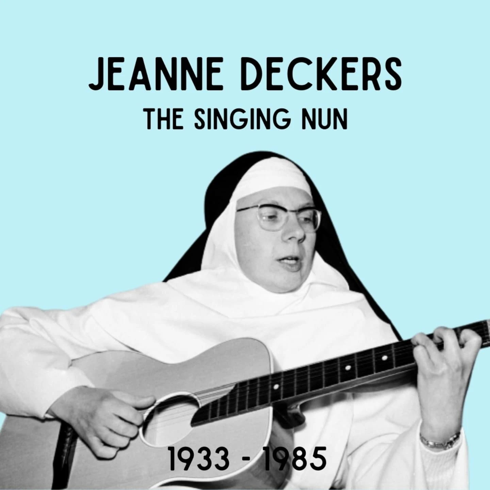
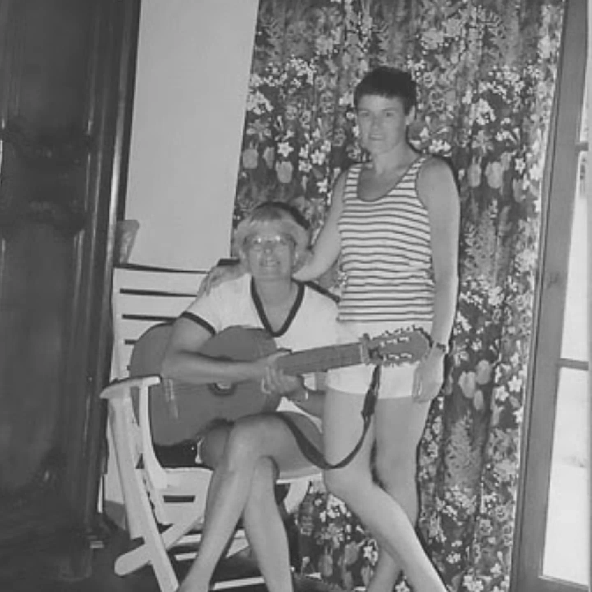
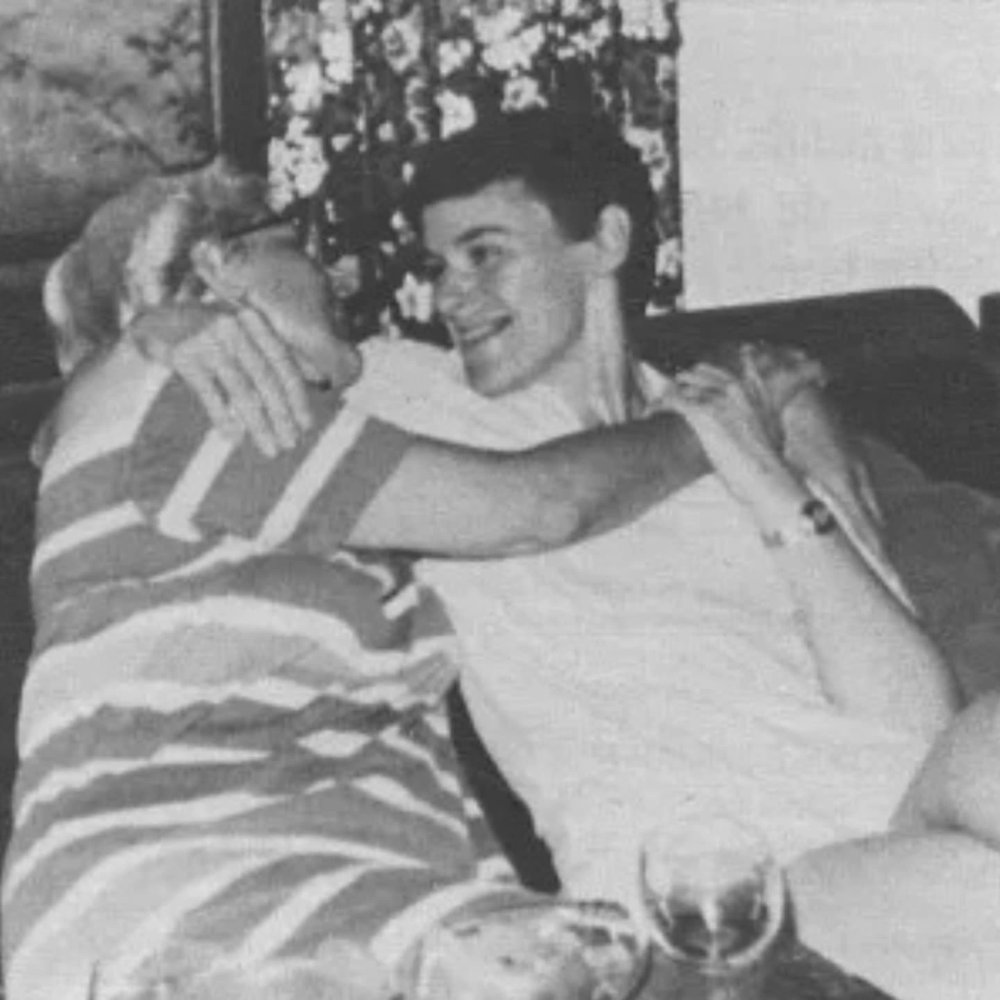

# DHyygFstKyM

**Date:** 2025-03-29 19:37:46

## Images

## Caption

Vandaag 40 jaar geleden is Jeanne Deckers overleden. Ze is geboren op 17 oktober 1933 in Brussel.

In 1960 treedt Jeanne als Soeur Luc-Gabrielle toe tot het dominicanessenklooster van Notre Dame de Fichermont in Waterloo, een klooster dat bekendstaat als 'modern'. Haar intrede in het klooster kan gezien worden als een vluchtweg: Jeanne staat in het onderwijs en haalt hier niet voldoende uit, en haar moeder bemoeit zich te pas en te onpas met haar leven. In het klooster leert Jeanne gitaar spelen en componeerde ze liedjes voor jongeren die er op retraite komen. Haar talent raakt ook bekend buiten de kloostermuren en platenmaatschappij Philips is benieuwd naar deze zingende non. Ze krijgt de kans om een plaat te maken en kiest voor de artiestennaam Soeur Sourire, Zuster Glimlach. Een van de nummers op de plaat - Dominique - wordt een gigantische wereldhit. Het lied wordt gecoverd in verschillende talen, staat wekenlang op nummer 1 in de VS en Jeanne is naast Gotye de enige Belg die ooit een Grammy wint. (En laten we eerlijk zijn, Gotye wordt vooral geclaimd door Australië.) De opbrengsten van haar muziek gaan naar Philips en het klooster. 

In 1966 verlaat ze het klooster wegens aanhoudende spanningen. Ze slaagt er echter niet in om haar succes als de zingende non te evenaren en kampt met financiële problemen. Daarbovenop zit de fiscus haar ook op de hielen voor de opbrengsten van haar muziek, die niet zij, maar het klooster heeft geïnd! Jeanne begint in haar nieuwe muziek ook voorzichtig te revolteren tegen de Kerk en schrijft o.a. een nummer over de anticonceptiepil. 

Samen met haar vriendin Annie Pécher, die ze in 1959 leerde kennen en met wie ze in 1963 het contact terug heeft opgepikt, start ze een school voor autistische kinderen. Jeanne en Annie hebben een diepe connectie en na jaren samenwonen ontwikkelen ze ook een lesbische relatie. Het schooltje raakt echter niet van de grond en geplaagd door financiële problemen en depressies, besluit het koppel om samen uit het leven te stappen. In hun afscheidsbrief vragen ze om samen begraven te worden na een kerkelijke begrafenis. 

#ZijWasEens #JeanneDeckers

