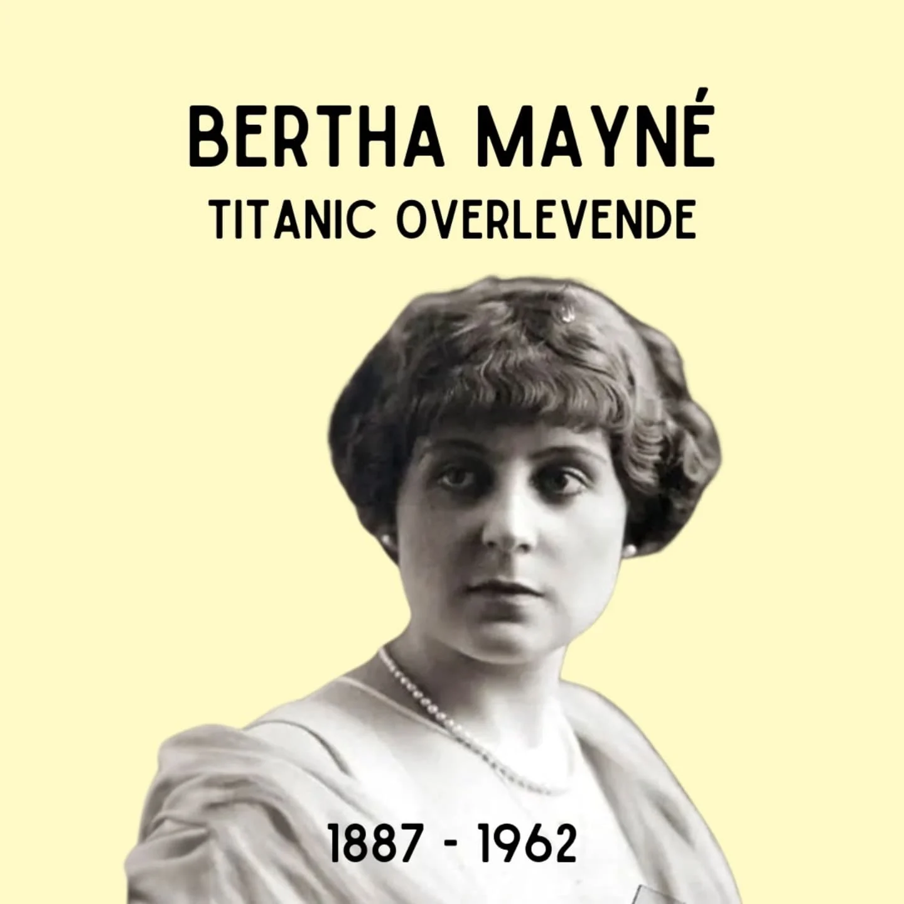
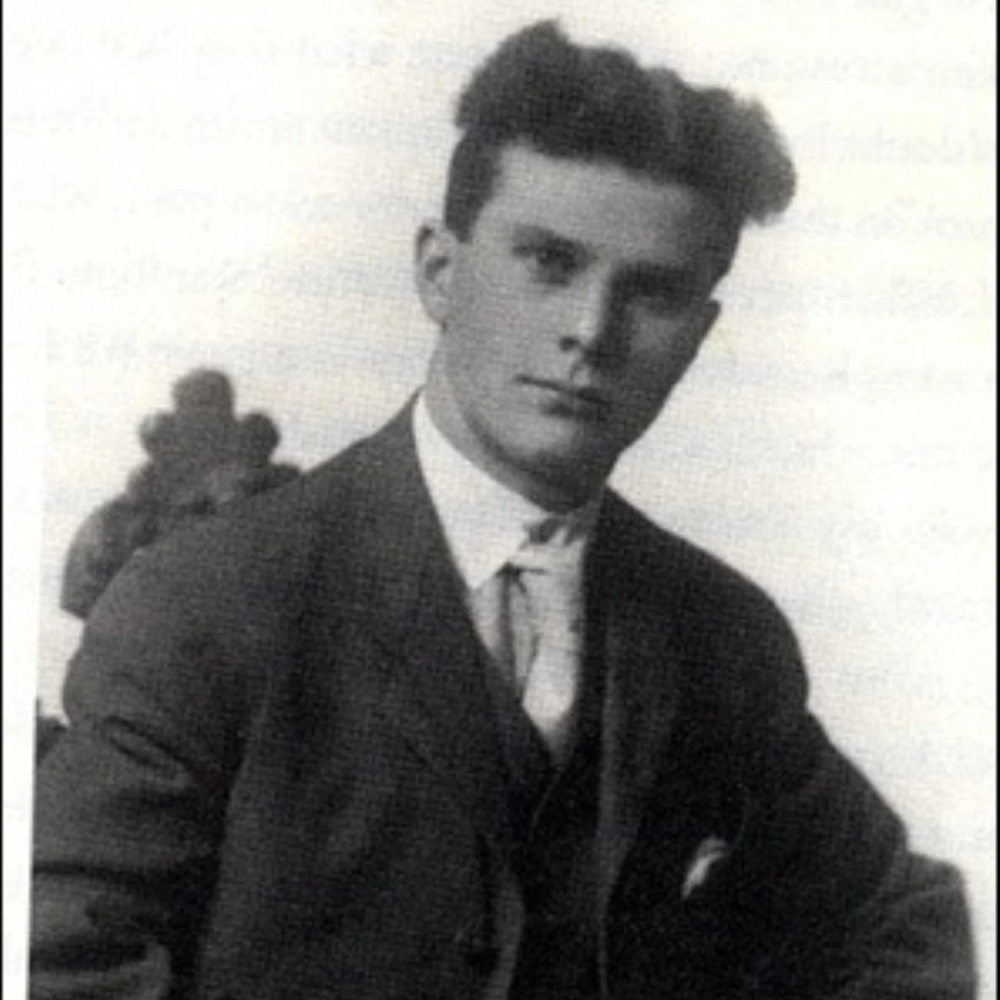
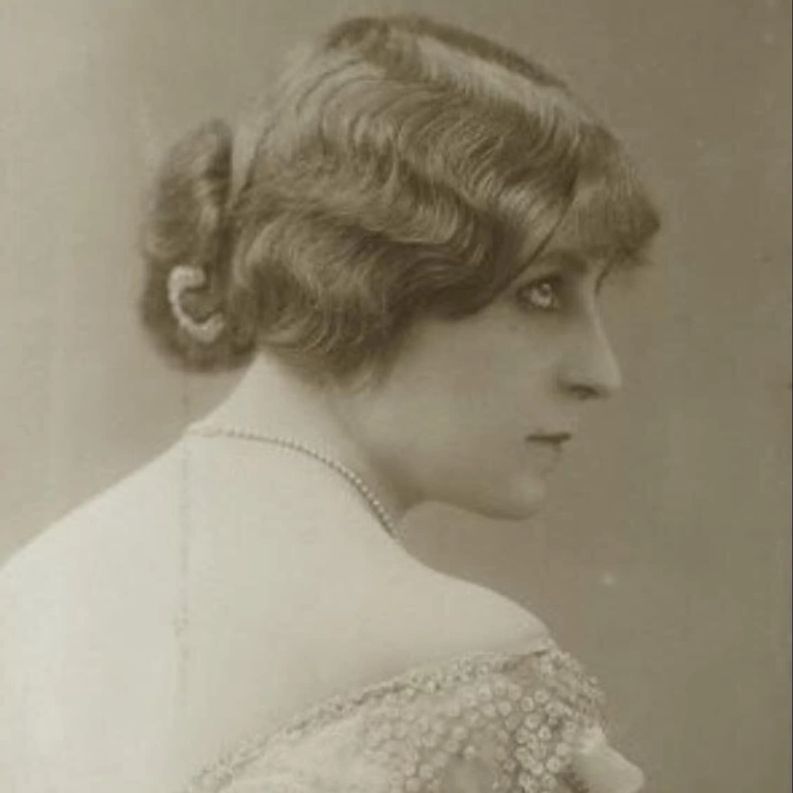
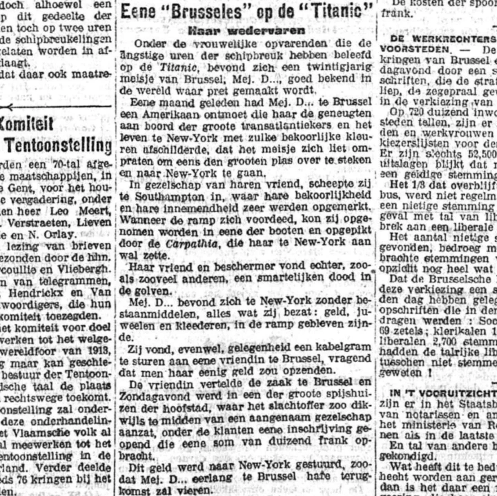

# DIavOwCNCJY

**Date:** 2025-04-14 08:58:48

## Images

## Caption

Vandaag 113 jaar geleden zou de Titanic haar laatste dag op zee meemaken. Een van de overlevenden die tot de verbeelding spreekt is de Belgische Bertha Mayné. 

Bertha Mayné is geboren op 21 juli 1887 in Brussel in een arbeidersgezin met zes kinderen. Al snel verlaat ze het ouderlijk huis om cabaretzangeres te worden, met succes. Haar beroep in het nachtleven brengt de nodige mannelijke aandacht met zich mee, onder andere van de legerofficier Fernand de Villiers. Wanneer hij naar Congo wordt gestuurd, neemt ze zijn naam aan als artiestennaam: Berthe de Villiers is geboren.

In 1912 wordt de rijke Canadese erfgenaam Quigg Baxter verliefd op Bertha tijdens een van haar shows. Ze beginnen een affaire en Quigg overtuigt haar om met hem mee te reizen naar Canada. Quigg, zijn moeder en zijn zus - die niet van de relatie op de hoogte zijn - hebben een dure suite in de Titanic geboekt. Ook Bertha boekt een eersteklassuite voor zichzelf, als 'Berthe de Villiers'. Ze zetten hun geheime relatie verder op de boot. Op de avond van de ramp ziet Quigg de ernst van de situatie meteen in. Hij zet zijn moeder en zus op een reddingsloep en overtuigt Bertha om zich bij hen te voegen. "Moeder, Zette (zijn zus), dit is Bertha. Draag zorg voor haar," zegt hij nog tegen zijn moeder en zus, die met verstomming geslagen zijn.

Quigg overleeft de ramp niet. Bertha verblijft nog enige tijd bij de Baxters in Montreal, die verzinnen dat ze een weduwe is die alles heeft verloren op de Titanic om te vermijden dat de roddelmolen over Quigg begint te draaien. In België is er slechts één krantenartikel dat wijst op de aanwezigheid van Bertha op het schip. Wanneer ze terugkeert naar België is quasi niemand op de hoogte van wat haar is overkomen, en Bertha wil ook niet cashen op haar ervaring (uit liefdesverdriet?). Vanaf 1913 pendelt ze als cabaretzangeres tussen Brussel en Parijs.

Op latere leeftijd vertelt ze wel over vroeger aan haar familie, die haar niet gelooft. Pas na haar dood zouden haar nabestaanden een doos met foto's en prullaria terugvinden, waaronder foto's van haar cabarettijd en een foto van Quigg. 

#ZijWasEens #BerthaMayné #Titanic

Bron: Vlamingen op de Titanic - Dirk Musschoot

