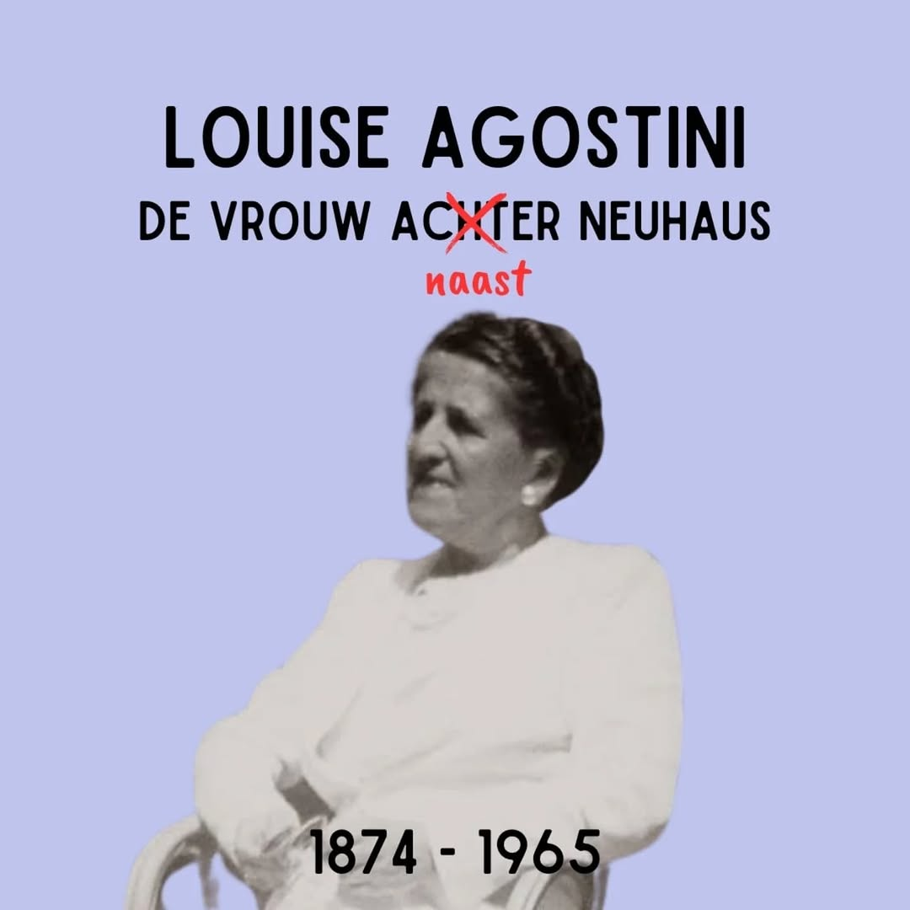
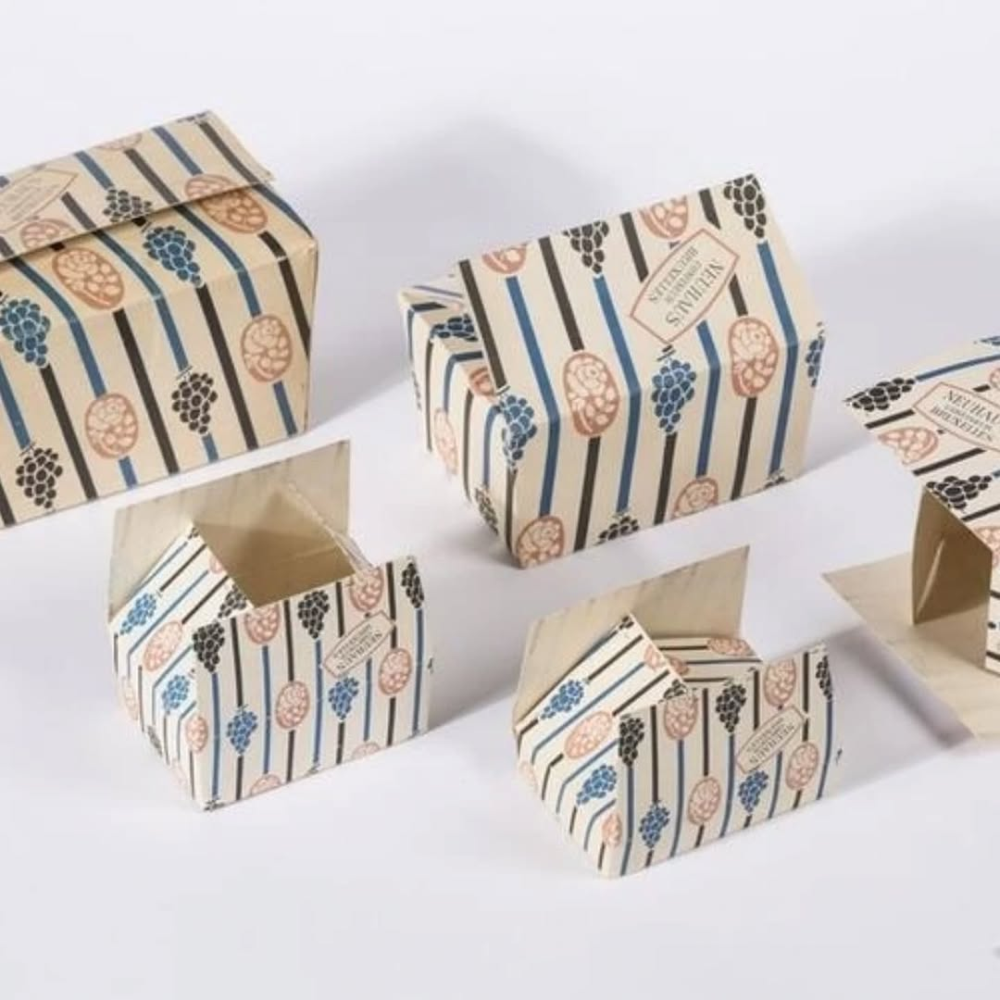
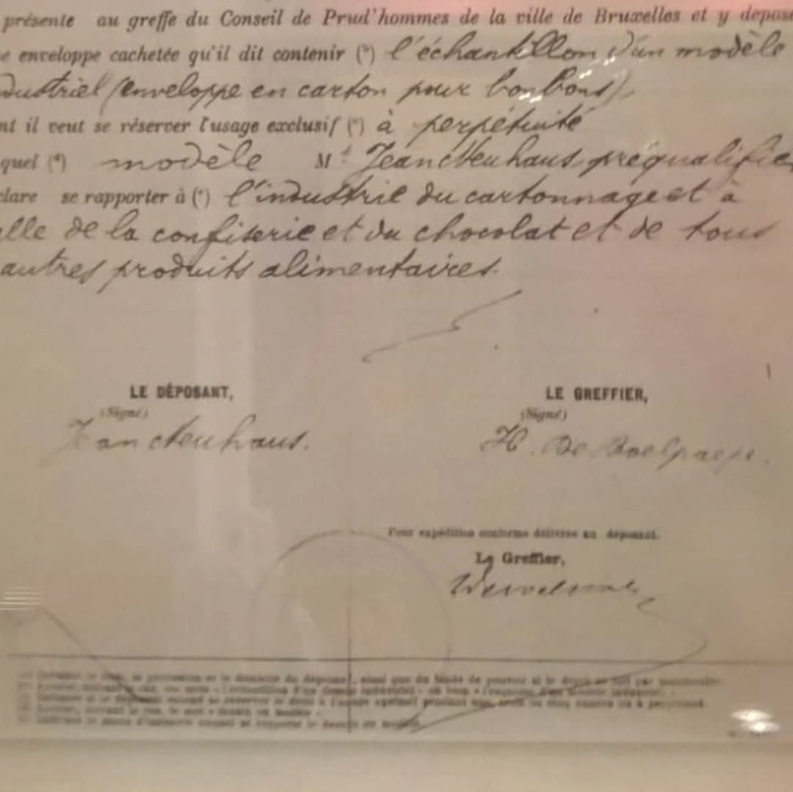

# DIjAWF2NDj_

**Date:** 2025-04-17 14:02:17

## Images

## Caption

Wist je dat de klassieke pralinedoosjes uitgevonden zijn door de echtgenote van chocolatier Jean Neuhaus Jr.? 

Vandaag 151 jaar geleden is Louise Agostini geboren in Brussel. In 1900 trouwt ze met Jean Neuhaus Junior. en wordt ze een belangrijke schakel in het uitbouwen van het bedrijf Neuhaus. 

Dit bedrijf is initieel een apotheek, geopend door de grootvader van Jean Jr. Hij besluit om de medicatie een laagje chocolade te geven zodat de pillen makkelijker verteerbaar zijn. Gaandeweg maken de medicijnen plaats voor allerlei zoetigheden. Jean Neuhaus Sr. en zijn zoon Frédéric zijn bezig met nieuwe lekkernijen te bedenken, maar het is kleinzoon Jean Jr. die voor de revolutie in de Belgische chocoladewereld zou zorgen door het uitvinden van de klassieke praline in 1912. Een gigantisch succes dat overal gekopieerd zal worden. 

Wanneer Louise aan de zijde van haar man in de confiserie aan de slag gaat, merkt ze op dat de pralines verkocht worden in puntzakken. De pralines raken op die manier makkelijker beschadigd tijdens het transport. Louise denkt na over een manier om de chocolaatjes beter te beschermen, en ze mooier te presenteren - als het ware als juweeltjes. In 1915 vindt ze de klassieke ballotin of de pralinedoos uit. Opmerkelijk: wanneer het ontwerp van het doosje gedeponeerd wordt, zien we onderaan het blad dat het Jean Jr. is die het ontwerp deponeert. Louise wordt hier niet vermeld. Ondertussen is dit al lang rechtgezet en wordt Louise door Neuhaus regelmatig gecrediteerd voor het uitvinden van het doosje. 

Vergeet jij de volgende keer ook niet aan Louise te denken wanneer je een pralinedoosje in je handen krijgt? 

Bronnen: @neuhauschocolates, @urban_brussels

