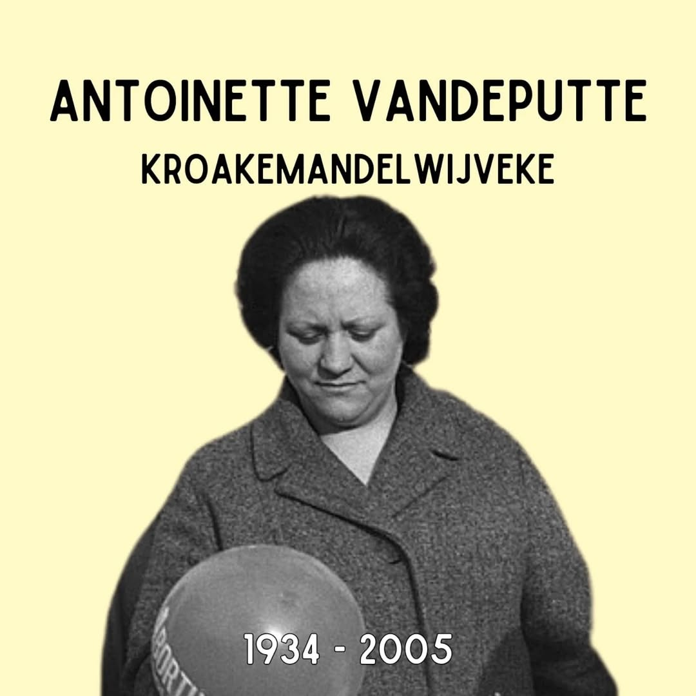
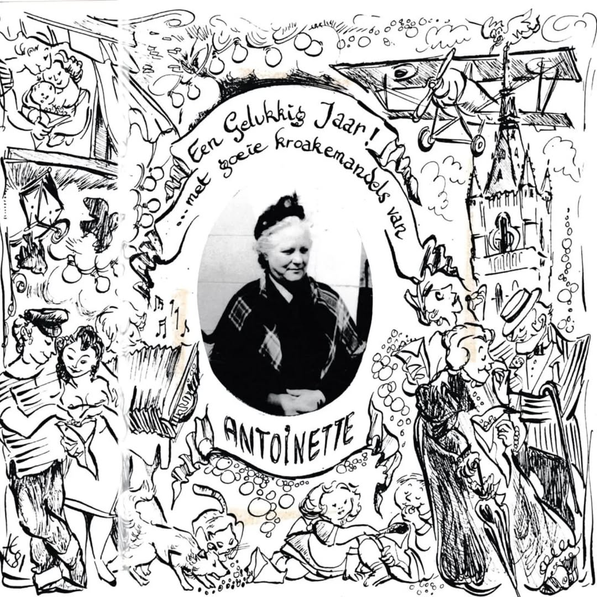
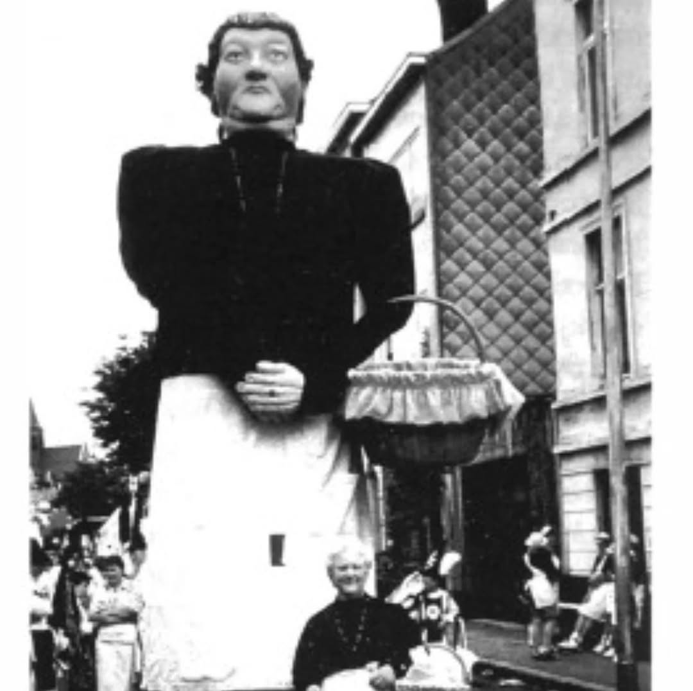
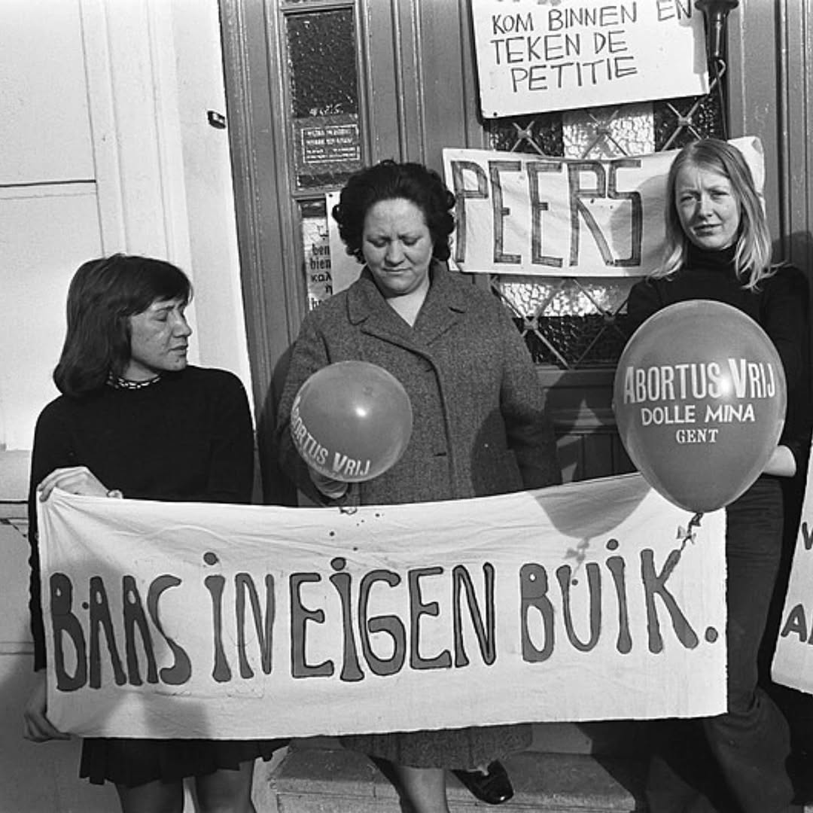

# DIt4jIut76Y

**Date:** 2025-04-21 19:25:48

## Images

## Caption

Vandaag 91 jaar geleden is Antoinette Vandeputte geboren in Ledeberg dichtbij Gent. 

Antoinette is de laatste verkoopster van de kroakemandel. Deze geliefde Gentse snack wordt ook het kaviaar van het werkvolk genoemd en werd bereid door het frituren en zouten van Engelse erwten. Als 'kroakemandelwijveke' gaat Antoinette wekelijks van café tot café om haar huisbereide kroakemandels te verkopen. Cafébazen zien de kroakemandelwijvekes graag komen want de zoute snack zorgt voor een stijging van hun drankverkoop. Antoinette zal dit 25 jaar lang doen, al komt ze op het einde slechts een paar keer per jaar buiten met haar mand kroakemandels: op de Gentse Feesten, de Patersholfeesten en de ambachtenmarkt in Drongen. In Gent is er een Antoinette Vandeputtepad, waar ze geëerd wordt als laatste verkoopster van de lekkernij. 

Toch verdient Antoinette dat pad misschien meer omwille van haar sociaal engagement. Ze is namelijk een verwoed antifascist en feminist en komt op voor abortusrechten. Ze kent de situatie van vrouwen die werken in textielfabrieken, worden lastiggevallen door hun bazen en met ongewenste zwangerschappen achterblijven. De rijke vrouwen vinden oplossingen, maar voor de armere meisjes zijn er enkel 'engeltjesmaaksters' met breinaalden. Antoinette kan dit niet aanzien en wanneer er in de jaren '70 bekend raakt dat er een dokter in Namen is die abortussen uitvoert spendeert ze al haar vrije tijd aan het begeleiden van meisjes en jonge vrouwen naar deze arts - dokter Willy Peers. Zij die de abortus niet durven ondergaan vangt ze ook op.

Wanneer dokter Peers gearresteerd wordt, gaat Antoinette samen met andere Gentse Dolle Mina's in hongerstaking. De steun voor dokter Peers stijgt en hij zal niet voor de Raadkamer moeten verschijnen. In 1990 wordt abortus na noodsituaties uit het strafwetboek gehaald, dokter Peers zal dit niet meer meemaken. De volledige depenalisering van abortus zal ook Antoinette niet meemaken: pas in 2018 wordt abortus uit het Strafwetboek gehaald. Al is dit eerder symbolisch: de bepalingen rond abortus zijn in een andere wet gegoten.

#ZijWasEens #AntoinetteVandeputte

