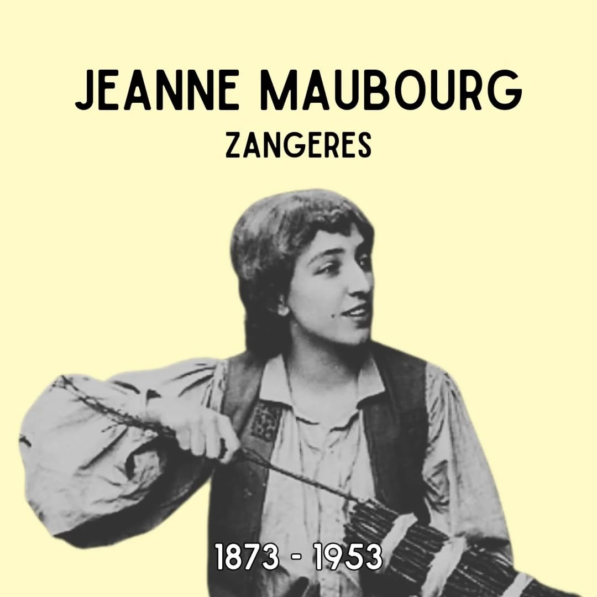
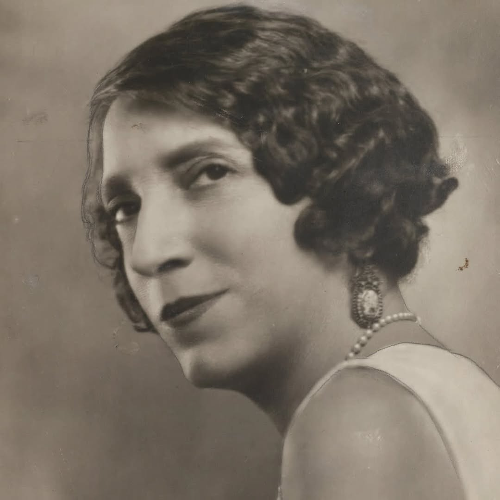
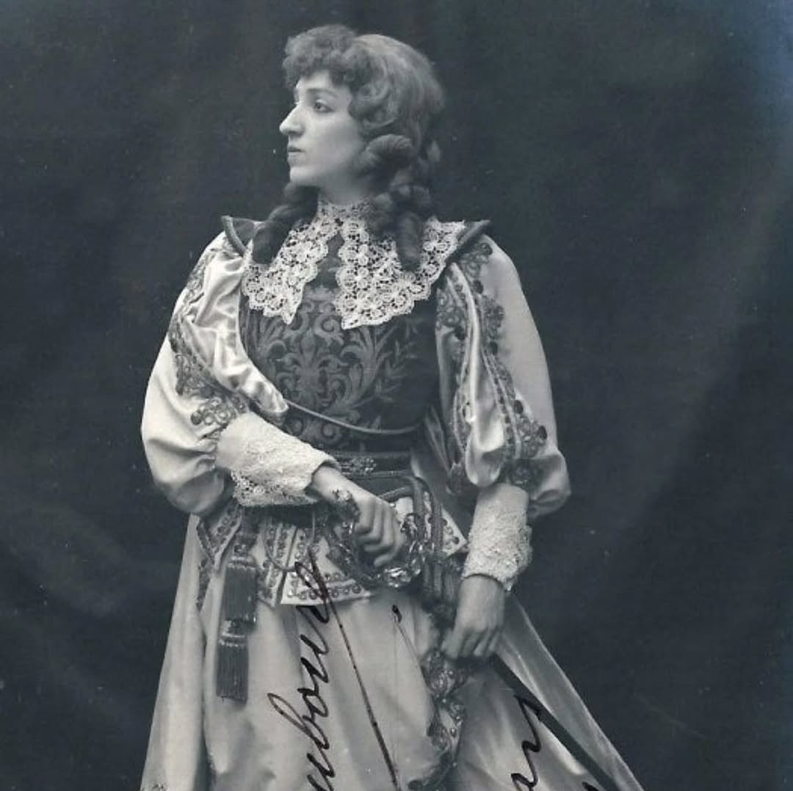

# DJcg2FGNnCH

**Date:** 2025-05-09 22:02:59

## Images

## Caption

Vandaag 72 jaar geleden is Jeanne Maubourg overleden in Montreal, Canada. Ze is geboren op 10 november 1873 in Namen. 

Haar eerste zanglessen krijgt ze van haar vader, die operette-dirigent is in het Théâtre royal des Galeries in Brussel. Hij is geen fan van het carrièrepad dat zijn dochter voor ogen heeft, maar ze verplicht hem om naar haar zang te luisteren en overtuigt hem van haar talent. In 1894 maakt ze haar debuut in De Munt. Recensenten loven haar loepzuivere stem. Haar haren zijn pikzwart, wat past bij dramatische stukken. Toch kiest Jeanne ervoor om haar haren blond te verven, wat ze het grootste deel van haar carrière zal blijven doen. Ze onderscheidt zich door haar persoonlijkheid: voor het wereldje waarin ze opklimt is ze eerder gereserveerd van aard. Hierover zegt ze zelf dat ze enkel houdt van 'scene' (schoppen) op het podium, niet ernaast. 

Na een paar jaar wordt België te klein voor haar en verbindt ze zich voor enkele jaren aan theater Covent Garden in Londen en vervolgens aan het Metropolitan Opera in New York. In deze periode is Jeanne voor een eerste keer getrouwd met de Franse acteur Claude Bede. Na twee jaar leven ze echter apart omdat hij negatief is over de Amerikanen, wat voor conflicten tussen hen zorgt. Hij beschuldigt haar van niet met hem getrouwd te zijn uit liefde, maar omdat hij lijkt op... Napoleon. De druppel die de emmer doet overlopen is echter een afspraakje van Claude met een onbekende blonde vrouw in een hotel, gespot door een getuige. Jeanne vraagt hierop de scheiding aan. Hierna is ze nog twee keer getrouwd.

In 1917 verhuist ze naar Canada. Ze verbindt zich hier aan een theater, maar begint ook zanglessen te geven aan het conservatorium in Montreal. Ze brengt de rest van haar leven in Montreal door, waar ze erg geliefd is. Na haar overlijden is de Avenue Maubourg in Montreal naar haar vernoemd. 

#ZijWasEens #JeanneMarbourg

