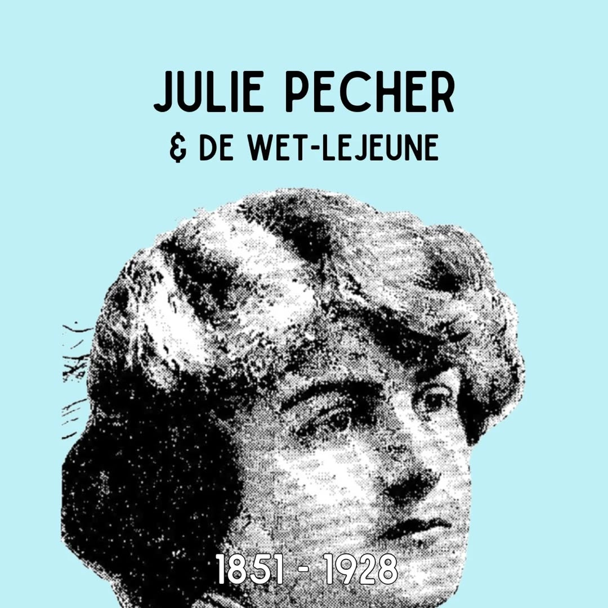
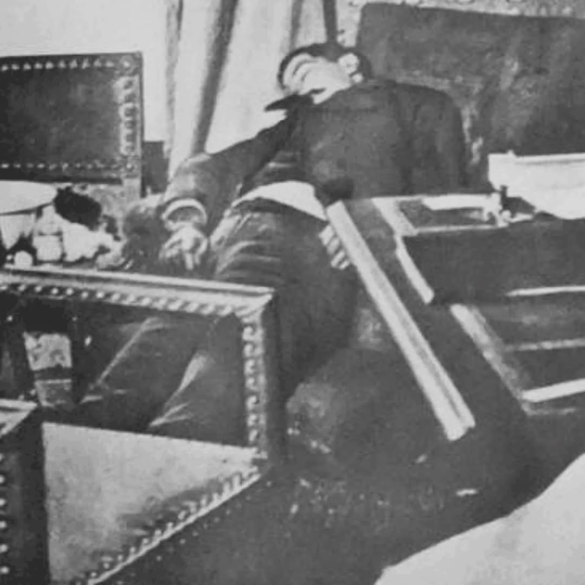

# DJeoAUHoNjq

**Date:** 2025-05-10 17:44:02

## Images

## Caption

Vandaag 97 jaar geleden is Julie Pecher overleden in Antwerpen. Ze is in dezelfde stad geboren op 15 januari 1851 in een bekende, rijke en liberale familie. 

Ze is vrij opgevoed. De omgeving van haar vader, Edouard Pecher, zal hem zelfs meermaals wijzen op 'Julies gedrag' en hem zeggen dat hij strenger moet zijn. Desondanks trouwt Julie in 1872 met de beloftevolle advocaat Guillaume Bernays. Hoewel hun huwelijk in het begin gemoedelijk verloopt, komen de eerste barsten al snel. Julie klaagt bij haar vader dat Guillaume haar niet goed behandelt. Enter Armand Peltzer. Armand is een bekende handelaar in het Antwerpse en een goede vriend, sommigen zeggen de enige vriend, van Guillaume. Hij ontpopt zich tot bemiddelaar en het koppel wendt zich tot hem wanneer ze ruzies hebben. Bij dit bemiddelen groeien zijn gevoelens voor Julie echter en al snel worden de twee het onderwerp van de roddelmolen van de Antwerpse beau monde. Hierop verbiedt Guillaume hem de toegang tot hun huis. 

Armand, tot over zijn oren verliefd, gaat over tot een wreed plan. Hij schakelt zijn broer Leon, die bij hem in het krijt staat, in en samen beramen ze de moord op Guillaume. Leon vermomt zich als Henry Vaughan, huurt een woonst in de Wetstraat en lokt Guillaume hiernaartoe onder het mom van een zakendeal. Wanneer Guillaume arriveert schiet hij hem neer. Enkele weken later licht hij de politie in via een brief en wordt het lijk van Guillaume gevonden. Al snel wijst men richting de broers Peltzer, de geruchten over de affaire zijn nog niet vergeten. 

De broers worden verdedigd door topadvocaten Edmond Picard en Jules Lejeune. Leon bekent de moord, maar beweert dat Armand er niks mee te maken heeft. Ook Julie gelooft in Armands onschuld. Toch worden beide broers in 1882 veroordeeld tot de dood, omgezet in een levenslange gevangenisstraf. Drie jaar later overlijdt Armand in gevangenschap. Lejeune beloofde Leon dat hij hem uit de gevangenis zal krijgen. 

(Lees verder in de comments, het is de moeite)

