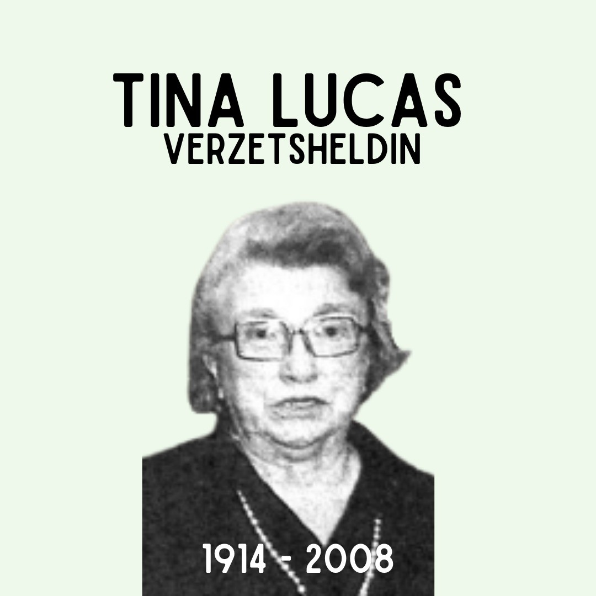
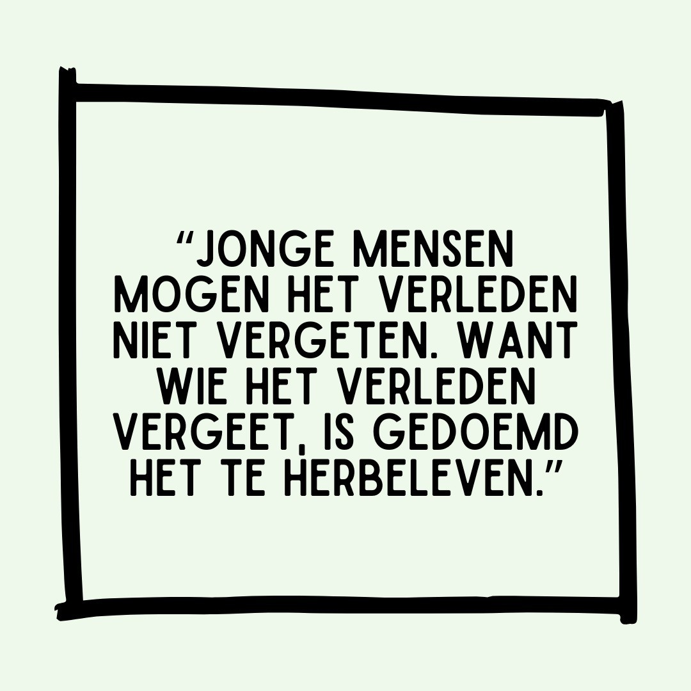

# ChUhaLNKsSV

**Date:** 2022-08-16 14:38:13

## Images

## Caption

108 jaar geleden zag Tina Lucas op deze dag het levenslicht in Hasselt. Samen met haar echtgenoot, Lucien Collin, sloot ze zich in 1940 aan bij het verzet. Het echtpaar hielp via het netwerk 'Evasion' zo'n vijftigtal neergestorte geallieerde piloten ontsnappen aan de nazi's. Lucas en Collin waren ook aangesloten bij de verzetsgroep Hoornaert-Dirix, die illegale pamfletten verspreidde. Op 18 juni 1943 worden Lucas en haar echtgenoot gearresteerd in hun winkel in Hasselt. Op dat moment hielden ze twee vliegeniers verborgen in huis. Lucien Collin wordt op 30 juni 1944 geëxecuteerd. Tina Lucas belandt in de concentratiekampen van Mauthausen en Ravensbrück. 

Na de oorlog wordt het haar grootste missie om jongeren te herinneren aan de gruwelen uit het verleden. Lucas gaat rond in scholen en heeft meer dan duizend spreekbeurten gegeven om het bewustzijn voor naziterreur levende te houden. 

Bron: 'Pilotenhulp tijdens Wereldoorlog II', Het belang van Limburg
Bron beeld: 'Pilotenhulp tijdens Wereldoorlog II'

#ZijWasEens #TinaLucas 

PS: Wie in het bezit is van een foto waar we een jonge Tina Lucas kunnen aanschouwen, mag dit altijd doorspelen!

