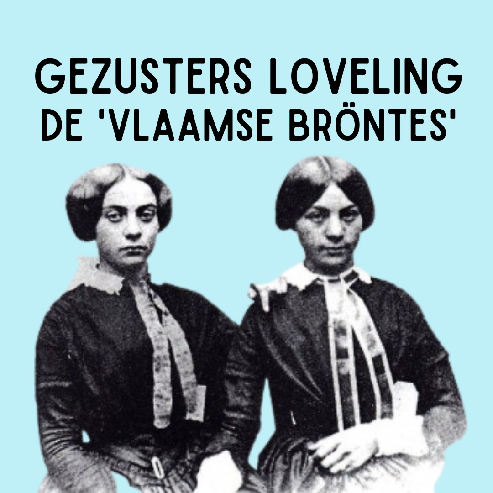
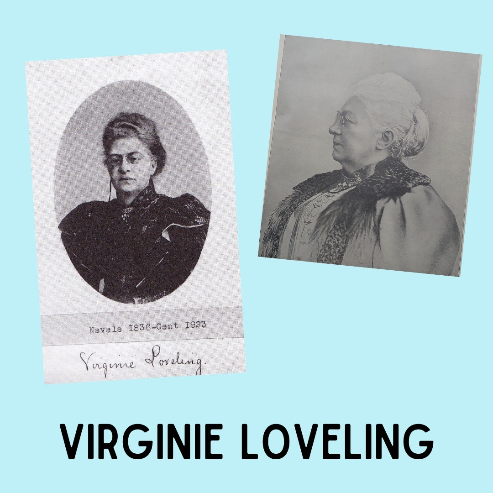

# ChZMKNKK1rd

**Date:** 2022-08-18 10:08:44

## Images

## Caption

Sociale media leert ons dat (althans in de V.S.) vandaag Bad Poetry Day gevierd wordt. Een ideaal moment om twee voorbeelden aan te halen die niet onder slechte poëzie vallen? 

Gentse studenten kennen misschien de Gezusters Lovelingstraat in het hart van de studentenbuurt. Deze straat is vernoemd naar Rosalie (links) en Virginie (rechts) Loveling, twee zussen die de liefde voor taal delen met elkaar - en via hun werk ook met de wereld. Na het overlijden van hun vader in 1846 verhuist het gezin Loveling van Nevele naar Gent. Het gezin is welgesteld en de zussen worden thuis onderwezen in verschillende onderwijstakken. Wanneer moeder Marie Comparé besluit om terug te keren naar Nevele, samen met oudere zus Pauline, verkiezen Virginie en Rosalie (op dat moment 13 en 15 jaar) om te blijven plakken in Gent. Herkenbaar. Gent inspireert hen en ze pennen hun waarnemingen neer in gedichten die ze later uitbrengen in gezamenlijke dichtbundels. De zussen wagen zich later ook aan proza. 

Rosalie overlijdt in 1875 op 41-jarige leeftijd, waardoor haar oeuvre minder groot is dan dat van haar zus. In het literair geheugen blijft inderdaad de naam van Virginie vooral nazinderen, al moeten we dit ook nuanceren: Virginie schreef regelmatig onder het 'mannelijke' pseudoniem W.G.E. Walters. Zou J.K. Rowling hier de mosterd gehaald hebben? 

Een persoonlijke aanrader van de hand van Virginie Loveling is het dagboek dat ze bijhield tijdens de Eerste Wereldoorlog. Een uniek werk waarin ze op meeslepende manier omschrijft hoe zij, en haar omgeving in Gent, de oorlog hebben ervaren. 

Bron: @rosavzw 
Bron beeld: Schrijversgewijs.be 

#ZijWasEens #VirginieLoveling #RosalieLoveling

