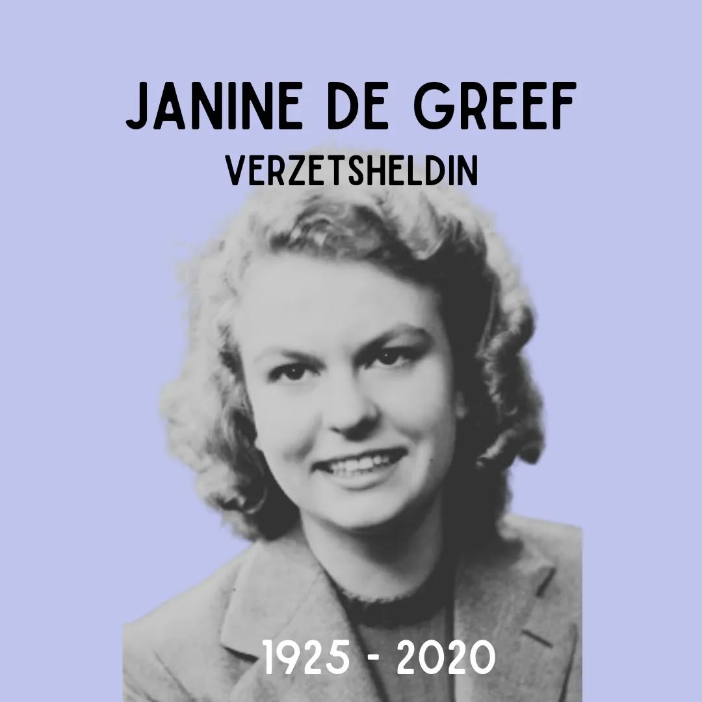

# DAVMGbitzDA

**Date:** 2024-09-25 09:04:29

## Images

## Caption

Vandaag 99 jaar geleden is Janine De Greef geboren in Etterbeek. Bij het uitbreken van WOII vlucht ze samen met haar ouders, Fernand en Elvire De Greef en haar broer Freddy het land uit. Hun bestemming is Spanje, maar het gezin beslist om zich te settelen in het Franse Anglet, nabij de Pyreneeën. Hier start het verzetsavontuur van het gezin: vader Fernand is tolk voor de Duitse bezetter en komt zo aan belangrijke documenten, moeder en dochter vormen een schakel in het netwerk Comète. Dit netwerk begeleidt geallieerde neergestorte piloten via een ontsnappingsroute uit België: via Brussel of Lille naar Parijs, vandaar naar Tours, Bordeaux of Bayonne, te voet over de Pyreneeën en dan via San Sebastian naar Madrid om via Gibraltar of Lissabon naar Engeland te gaan. Haar eerste missie voert Janine uit wanneer ze 16 is. Ze begeleidt meer dan 30 keer verschillende groepen geallieerden op de trein, tram, fiets of te voet. Haar jeugdige uiterlijk maakt haar onverdacht. De Greef overlijdt in 2020; haar overlijden passeert vrijwel geruisloos in België, in tegenstelling tot het Verenigd Koninkrijk. In 2024 brengt de VRT hulde aan het Comètenetwerk in het programma 'Hier en toen'.

