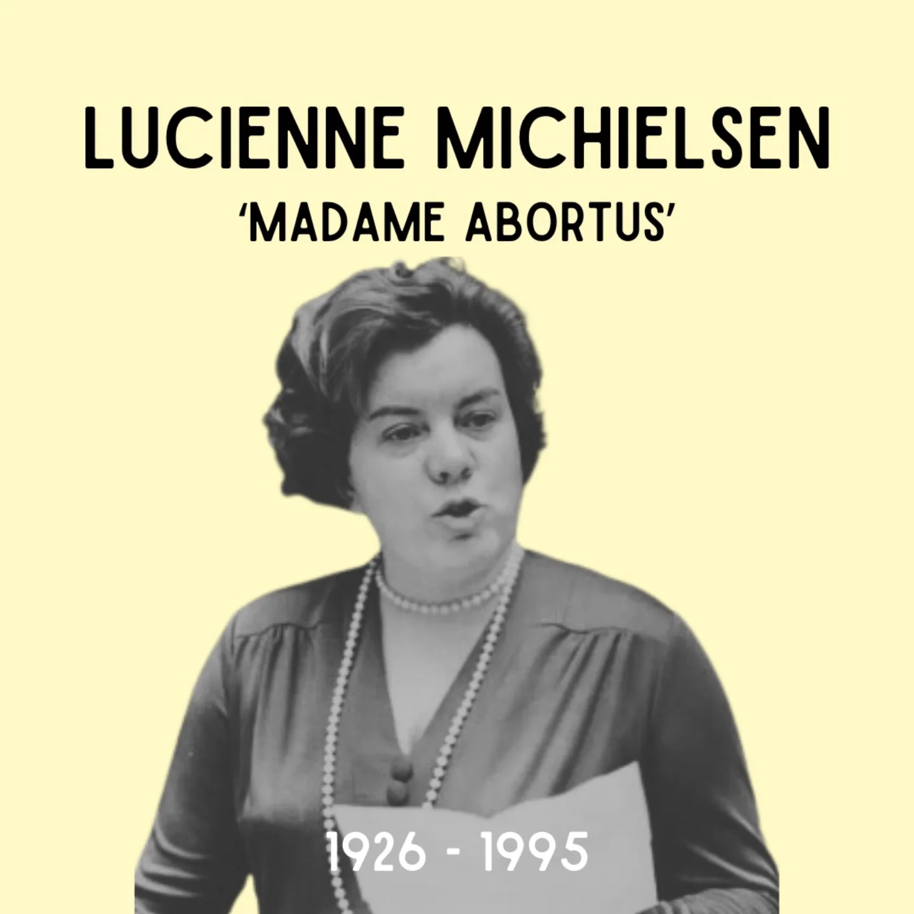

# DFH3ME7NU-U

**Date:** 2025-01-22 10:28:36

## Images

## Caption

Vandaag 30 jaar geleden is Lucienne Michielsen overleden. 

Lucienne is geboren op 13 maart 1926 in Gent. Tijdens haar studententijd is ze actief bij de liberale studentenvereniging LVSV. Het is in die periode dat ze Willy De Clercq leert kennen, die haar later zal verleiden tot de actieve politiek bij de liberale partij PVV. Deze partij zal later opgaan in Open VLD. Lucienne mag naar aanleiding van een ethisch congres van de PVV een werkgroep van PVV-vrouwen leiden, waarin gediscussieerd wordt over o.a. contraceptie en abortus. De conclusies van deze werkgroep worden opgenomen in de regeringsverklaring wanneer de PVV enkele maanden later in de regering stapt. In 1977, wanneer Lucienne gecoöpteerd senator is, dient ze een wetsvoorstel rond abortus in. Op dat moment is ze vooral bezig in termen van gezondheid en veiligheid van de vrouw. De feministische beweging kan zich niet helemaal vinden in dit voorstel, aangezien er wordt uitgegaan van een noodsituatie waarin de zwangere vrouw zich moet bevinden.

Lucienne wordt door de beweging uitgenodigd in een clandestien abortuscentrum in Gent. Hier raakt ze overtuigd en in een nieuw wetsontwerp, ingediend met Roger Lallemand, wordt 'noodsituatie' vager omschreven waardoor er meer beslissingsmacht is voor de vrouw. Dit voorstel wordt in 1990 - na de mini-koningskwestie - goedgekeurd. Door vijanden zal Lucienne schertsend 'Madame abortus' genoemd worden. 

Het voorstel van Lucienne en Roger Lallemand haalt abortus evenwel niet uit het strafrecht, maar bepaalt in welke omstandigheden er geen misdrijf is. Pas in november 2018 wordt abortus uit het Belgisch strafrecht gehaald. Al is dit eerder symbolisch: de bepalingen rond abortus zijn in een andere wet gegoten.

Bronnen: @rosavzw @dewereldmorgen_be

#ZijWasEens #LucienneHermanMichielsen #Abortus

