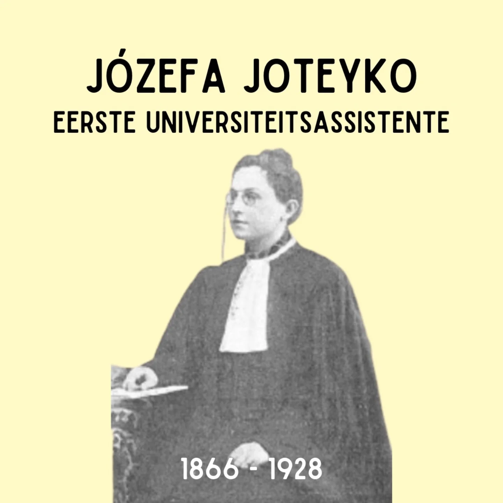
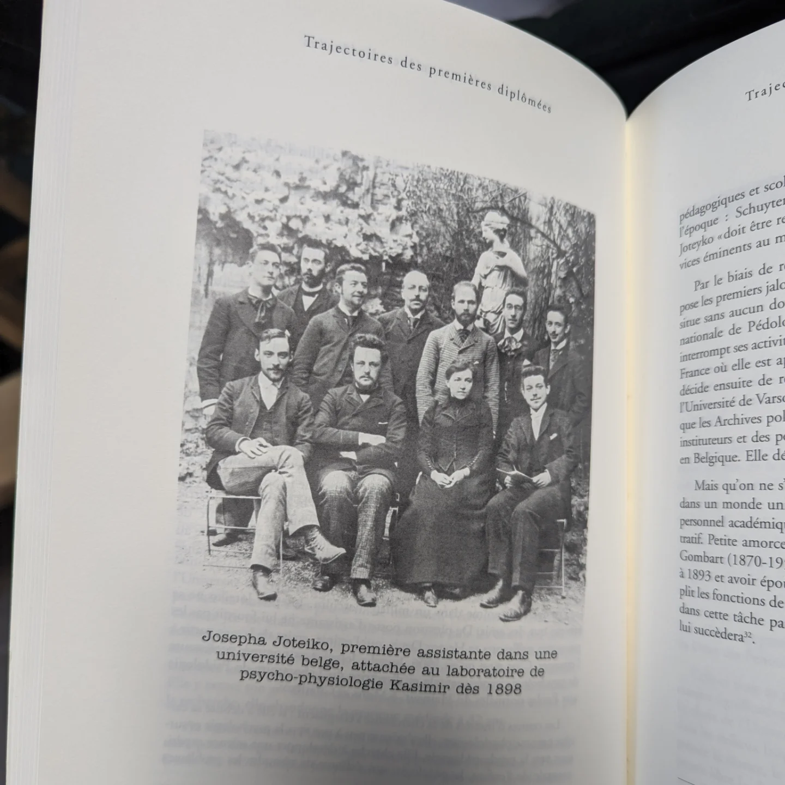

# DFZ7YhbNSty

**Date:** 2025-01-29 10:51:35

## Images

## Caption

Vandaag 159 jaar geleden is Józefa Joteyko geboren in Kiev.

Ze groeit er op in de Poolse intellectuele elite en verhuist in 1873 dan ook met haar gezin naar Warschau, waar de kinderen volgens hun ouders een betere opleiding zouden kunnen genieten. Omdat haar moeder haar niet naar een staatsschool wilde sturen - waar de Russen de plak zwaaien en haar Poolse identiteit onder vuur zou liggen - krijgt Józefa thuis lessen van Poolse leerkrachten. Wanneer het tijd wordt om hoger onderwijs aan te vatten, trekt ze naar Genève voor de opleiding natuurwetenschappen, aangezien vrouwen niet verder mogen studeren in Polen op dat moment. Na het behalen van haar diploma trekt ze naar Parijs, waar ze in 1896 nog een diploma geneeskunde behaalt. Het is ook in Parijs dat ze haar 'levensgezellin' Michalina Stefanowska ontmoet, met wie ze ook professioneel samenwerkt. Ze blijft nog twee jaar in Parijs als arts, maar de academische wereld lonkt. 

Aan de ULB zoeken ze op dat moment iemand om fysiologie te doceren. Józefa is de geknipte kandidaat en verruilt Parijs voor Brussel. Ze wordt de eerste vrouwelijke universiteitsassistent van België en haar onderzoekswerk wordt beloond met meerdere prijzen. Ze begint zich ook meer en meer te interesseren voor het domein van de psychologie en de psychopedagogie.

Maria Grzegorzewska, een Poolse leerkracht, is geïnteresseerd in Józefa's werk en volgt haar achterna naar België om hier te studeren. De twee vrouwen kunnen het goed met elkaar vinden. Na het uitbreken van WOI vlucht Maria naar Londen, Józefa blijft nog even in België maar trekt daarna ook naar het noorden. Het duo verhuist daarna samen naar Parijs, waar Józefa haar werk verder zet. Toch lukt het haar niet om in Frankrijk full time aan de slag te blijven. In 1919 keren Józefa en Maria dan maar terug naar Polen. 

Józefa is een overtuigd feminist en vindt dat alle jobdomeinen toegankelijk moeten zijn voor mannen én vrouwen. Toch kunnen we niet anders dan opmerken dat haar levenswandel en carrièrepad enorm uitzonderlijk is voor vrouwen in die tijd. Ze overlijdt op 24 april 1928 in Warschau. 

#ZijWasEens #JozefaJoteyko

Bronnen: 'Emma, Louise, Marie ...' door E. Gubin & V. Piette

