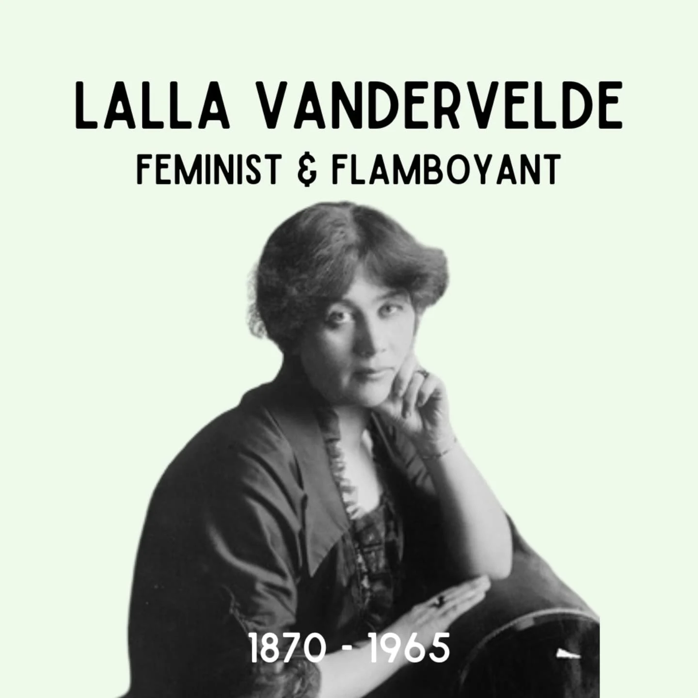
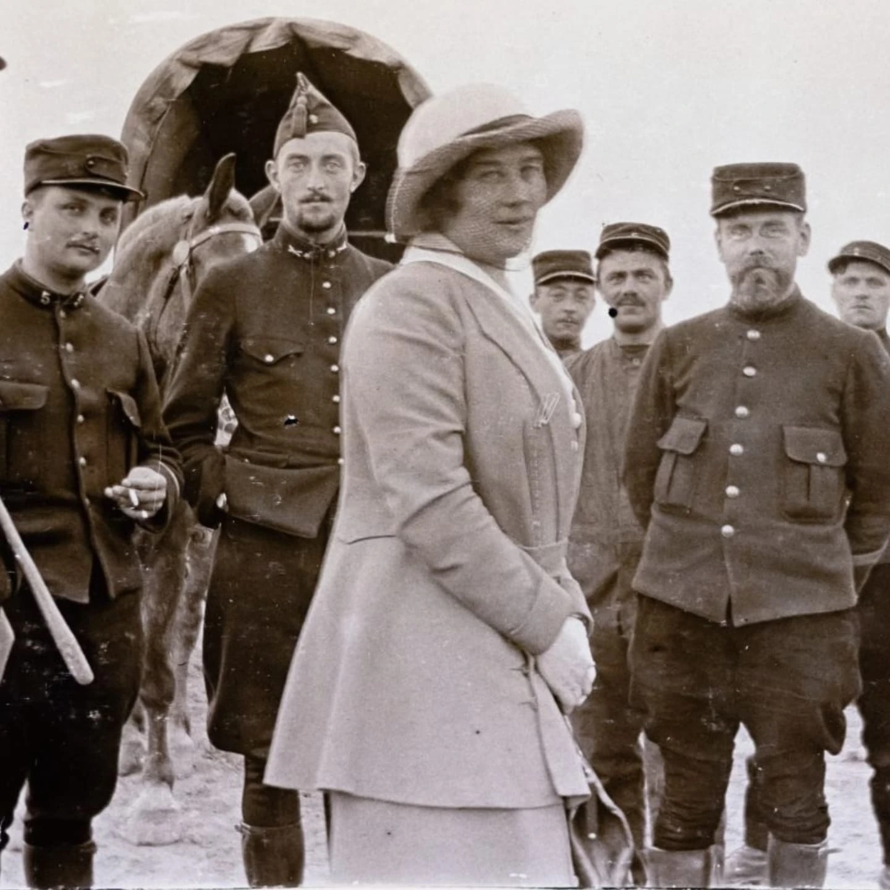

# DIBjGc0Nh9c

**Date:** 2025-04-04 14:11:48

## Images

## Caption

Vandaag 155 jaar geleden is Charlotte Speyer geboren in een welvarende Londense familie. Haar roepnaam is Lalla, naar haar Italiaanse grootmoeder. 

Op zestienjarige leeftijd wordt Lalla naar Brussel op internaat gestuurd. In Brussel leert ze haar eerste echtgenoot kennen, maar dit huwelijk strandt. 

Via een Brits koppel komt Lalla in contact met de wonderjongen van de socialistische BWP, Emile Vandervelde. Op 15 februari 1901 treden ze in het huwelijksbootje. Lalla raakt overtuigd van het socialisme, en op haar beurt probeert ze feministische strijdpunten, zoals vrouwenstemrecht, op de agenda van de BWP te plaatsen. Door een akkoord tussen de sossen en de liberalen zal het vrouwenstemrecht er echter pas in 1949 komen. Emile zal wel de initiatiefnemer zijn van verschillende wetten voor de emancipatie van de vrouw, onder invloed van Lalla? 

Lalla probeert ook om cultuur tot bij de arbeiders te krijgen door o.a. klassieke concerten voor hen te organiseren, wat na een tijd niet meer aanslaat. De arbeiders willen korte meetings, afgewisseld met cabaret en volksliedjes. Lalla, die vertoeft in zeer artistieke milieus en de muze is van verschillende bekende kunstenaars, is gedesillusioneerd.

Tijdens WOI trekt Lalla naar de VS om geld in te zamelen voor de Belgische burgers en soldaten. Ze maakt indruk bij de Amerikanen, Theodore Roosevelt noemt haar 'a very exceptional woman'. In België trekt ze ook naar het front om concerten te geven aan de Belgische soldaten (zie foto). 

Opmerkelijk is dat Emile geen gewag maakt van Lalla in zijn memoires. Toch is het koppel meer dan 20 jaar getrouwd geweest. Ze scheiden in 1922. Na de scheiding blijft ze de naam Vandervelde gebruiken. De 'meest prominente vrouw van België' (verkozen door het blad Pourquoi Pas? in 1921) belandt echter in het vergeethoekje van de Belgische geschiedenis. 

Bron: 'Madame Lalla Vandervelde' door Martine Vermandere

@amsab_isg @zij_kant

