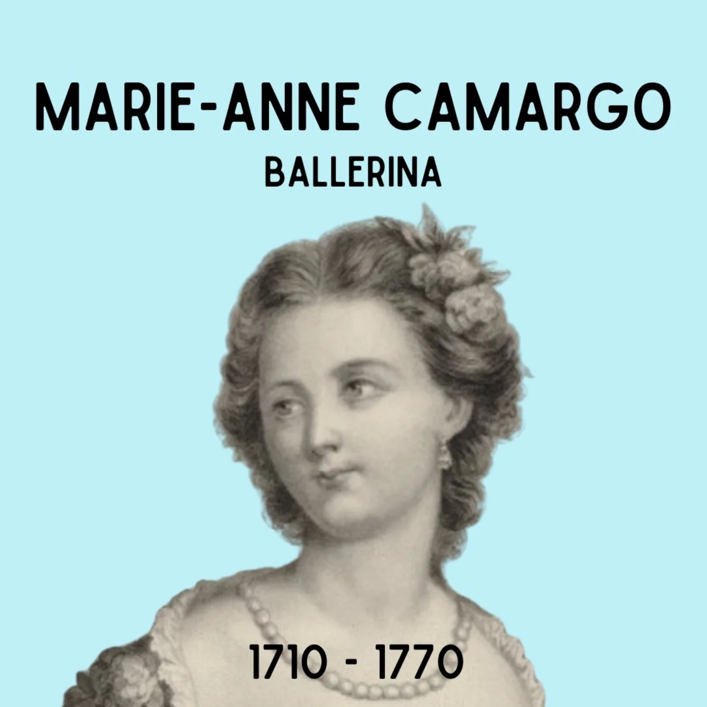
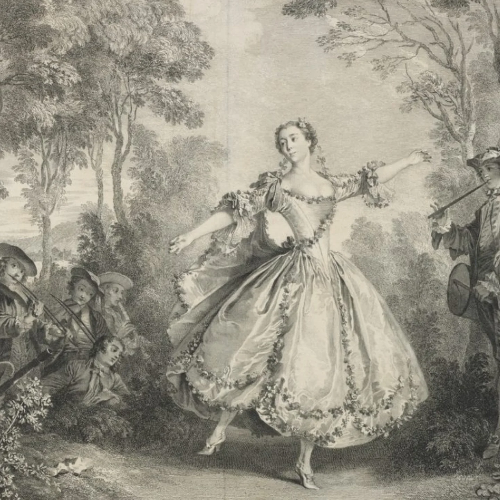

# DIdSeVOtkC6

**Date:** 2025-04-15 08:45:15

## Images

## Caption

Vandaag 315 jaar geleden is Marie-Anne Camargo de Cupis geboren in een Brussels gezin met Italiaanse roots.

Haar eerste danslessen krijgt ze van haar vader, die de kost verdient als muziek- en dansleraar. Haar vader moedigt haar ook aan om te dansen in Parijs, waar ze verder onderricht wordt door publiekslieveling Françoise Prévost. In 1726 debuteert Marie-Anne in de opera. Françoise is geen girl's girl, want wanneer ze het stijgende succes van Marie-Anne ziet probeert ze haar in een ondergeschikte positie te houden. Dit zorgt ervoor dat Marie-Anne haar opleiding niet bij Françoise, maar bij een andere leerkracht zal verderzetten. Haar spectaculaire doorbraak lonkt. Al snel spreekt iedereen over Camargo en haar naam wordt in één adem genoemd met de nieuwste danstrends. Ze introduceert ook de korte rokken aan de Opera van Parijs, omdat de lange gewaden haar dans hinderen en haar indrukwekkende sprongen minder zichtbaar maken.

Françoise en Marie-Anne worden tegen elkaar opgezet, waarbij Marie-Anne door het publiek telkens als lieveling wordt bestempeld: zij voert alle danspassen beter uit. Marie-Anne kan zelfs passen aan die tot dan toe enkel door mannen gedaan werden omdat ze fysiek zwaar zijn. Ook tijdsgenoot Voltaire gaat mee in de rivaliteit, maar plaatst Marie-Anne tegenover danseres Marie Sallé, een andere concurrente, in een kort tekstje waarin hij beide danseressen bejubelt. 

Haar schoonheid zorgt voor veel bewondering. Marie-Anne wordt niet één, maar twee (!) keer ontvoerd door mannen die verliefd zijn op haar, respectievelijk de graaf van Melun en de graaf van Clermont. De tweede keer zou het echter met haar toestemming gebeurd zijn. Misschien was graaf van Clermont uitzonderlijk geëngageerd en getalenteerd?

Zelfs na haar pensioen inspireert ze dansers in Frankrijk en Italië. Haar naam wordt in 1930 zelfs gebruikt in het V.K. bij de oprichting van de Camargo Society, een organisatie die het Brits ballet promoot. Marie-Anne Camargo overlijdt op 28 april 1770 in Parijs. 

#ZijWasEens #MarieCamargo

Bronnen: Biographie nationale de Belgique (Tome 3), Dance biographies blog

